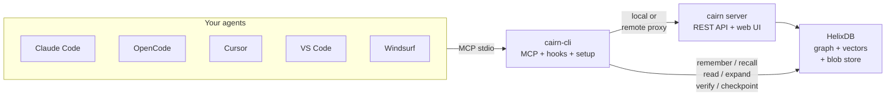
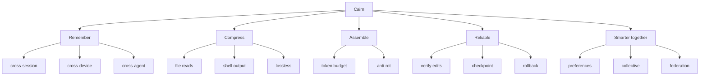

<div align="center">


# Cairn

### The open-source context & reliability layer for AI agents

**Make any model smart.** Remember everything · feed less, not more · stay reliable on long
tasks · get smarter together — self-hosted, with no context ever lost.

</div>

---

> A cairn is a stack of trail-marker stones. Travelers each add a stone, and everyone who follows
> benefits. Each coding session leaves a marker the next one follows (**memory**); a cairn is
> minimal — only the stones you need to navigate (**lean, no-loss context**).

Cairn sits between your AI coding agents (Claude Code, OpenCode, Cursor, …) and your code.
It runs as one small server you self-host once, and every device + agent connects to it through a
single MCP endpoint plus lifecycle hooks.



## Why

AI agents fail on long, multi-session work in ways bigger context windows don't fix:

- They **forget everything** between sessions.
- They **re-read files** they already read, burning tokens.
- Quality **decays over long tasks** (context rot, reasoning drift, silent corruption).
- Memory is **siloed** per machine and per tool.

The bottleneck usually isn't the model's IQ — it's the **context fed to it** and the **drift over
time**. Cairn fixes that.

## Five pillars



1. **Remember** — decisions and rationale persist across sessions, devices, and agents.
2. **Compress without loss** — files and shell output shrink in the window, stay fully recoverable.
3. **Assemble lean context** — feed *less*, higher-signal, well-ordered context under a token budget.
4. **Stay reliable** — verify edits vs originals, checkpoint/rollback, re-anchor on drift.
5. **Get smarter together** — learn preferences + opt-in sanitized collective knowledge.

## Proof

Run **`cairn-cli bench`** on your own repo. Measured on Cairn's own `crates/` (25 files):

| Mechanism | Before | After | Saved |
|---|---|---|---|
| AST outline reads | ~59,052 tok | ~5,894 tok | **90%** |
| Re-reading an unchanged file | ~6,506 tok | ~19 tok | **99.7%** |
| Shell output (verbose test log) | 153 lines | 1 line | **99%** |

All lossless — the full original is retained and one `expand` away. See [Benchmarks](docs/BENCHMARKS.md).

## Quick start

```sh
# Docker — the full stack (Cairn + HelixDB + MinIO), the easiest path
cp .env.example .env          # set MinIO credentials (see .env.example)
docker compose up -d          # builds Cairn, pulls HelixDB + MinIO, wires them together
# → http://localhost:7777
```

```sh
# Linux / macOS — one-liner
curl -fsSL https://raw.githubusercontent.com/Vellixia/Cairn/main/scripts/install.sh | sh

# Windows (PowerShell)
irm https://raw.githubusercontent.com/Vellixia/Cairn/main/scripts/install.ps1 | iex
```

```sh
# From source
cargo install --git https://github.com/Vellixia/Cairn cairn-server cairn-cli
```

Cairn stores data in **HelixDB** — `docker compose` starts one for you, or point
`CAIRN_HELIX_URL` at an existing server. Then run `cairn serve` and open
<http://127.0.0.1:7777>.

## Connect an agent

```sh
cairn-cli setup --all         # auto-detect every installed agent and wire up MCP
# or target one:
cairn-cli setup opencode --server http://localhost:7777 --token <token>
```

Supports Claude Code (MCP + lifecycle hooks), OpenCode, Cursor, VS Code, Windsurf.
See [Architecture — Connecting an agent](docs/ARCHITECTURE.md#connecting-an-agent-by-hand) for manual setup.

## Status

🚧 Active development — the engine is functional today. See [Roadmap](docs/ROADMAP.md) for
what's done and what's next.

## Upgrading from a pre-P0–P3 build

The hardening release includes several breaking changes. If you're upgrading from a build that predates the JWT / TLS / SHA-pin work, do this in order:

1. **Generate a `CAIRN_SECRET_KEY`** (≥ 32 bytes):
   ```sh
   openssl rand -base64 48
   ```
   Add it to `.env` (or `~/.config/cairn/.env`). The server refuses to start without it.

2. **Re-mint device tokens.** Old plaintext tokens are invalid under the new auth path. For each existing device:
   ```sh
   cairn-cli token create --name <device> --scope <admin|write|read>
   ```
   The bearer value is shown once; the server stores only metadata. Update each agent to use the new token.

3. **Update CLI invocations.** `cairn install` was renamed to `cairn-cli setup`. If you have scripts calling `cairn install`, switch to `cairn-cli setup`.

4. **TLS for network binds.** If you bind `cairn serve` to a non-loopback address, set `CAIRN_TLS_CERT` + `CAIRN_TLS_KEY`. `CAIRN_INSECURE=1` is allowed only for trusted local networks.

5. **Docker compose.** The bundled stack now binds to `127.0.0.1:7777` by default. Override with `-p "0.0.0.0:${CAIRN_PORT:-7777}:7777"` for LAN exposure.

See [CHANGELOG.md](CHANGELOG.md) for the full list of breaking changes and security hardening.

## Documentation

| Doc | Description |
|---|---|
| [Plan](docs/PLAN.md) | Product vision, problem analysis, core principles |
| [Architecture](docs/ARCHITECTURE.md) | Crate graph, MCP tools, API endpoints, Docker, config, CLI commands, multi-device sync |
| [Roadmap](docs/ROADMAP.md) | Development status — done, in progress, next |
| [Benchmarks](docs/BENCHMARKS.md) | Token savings methodology + measured results |
| [Audit Report](docs/audits/REPORT.md) | Security audit with fix-status tracking |

## License

Apache-2.0. See [LICENSE](LICENSE).