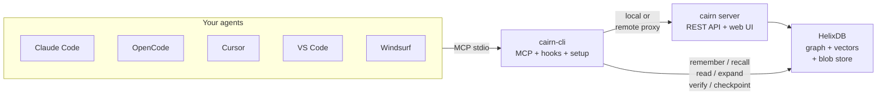
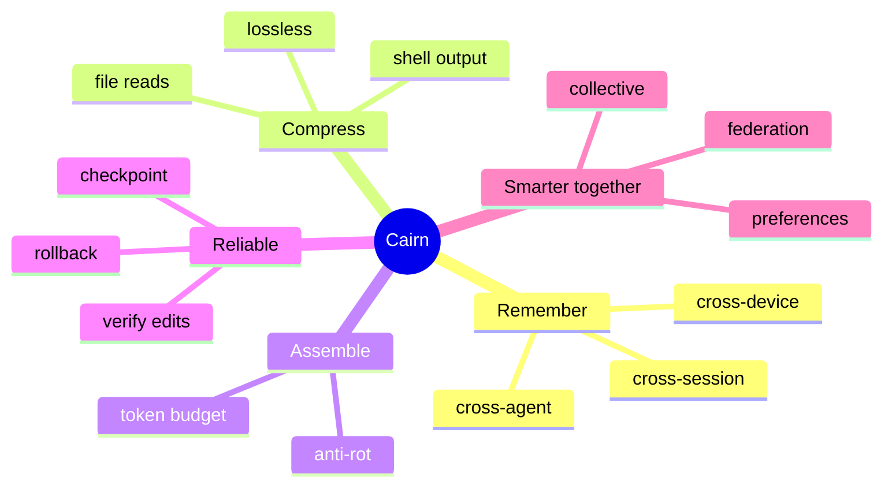
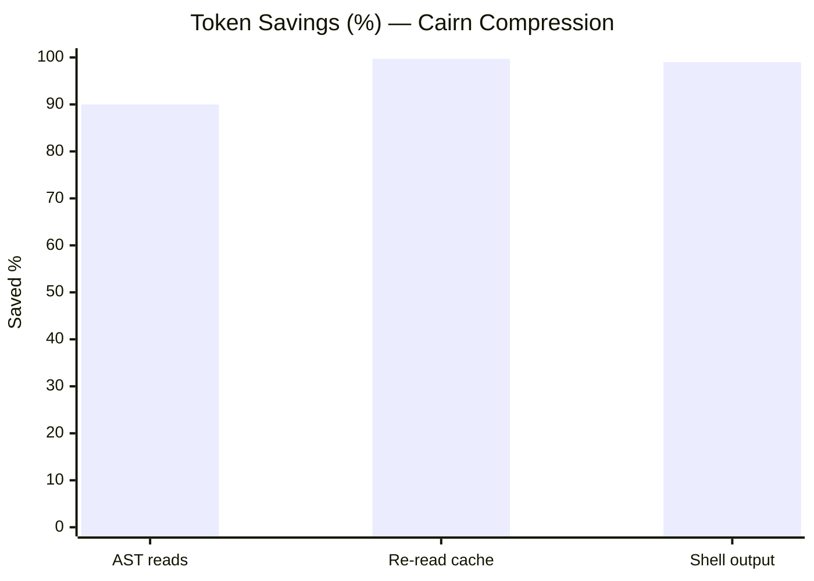
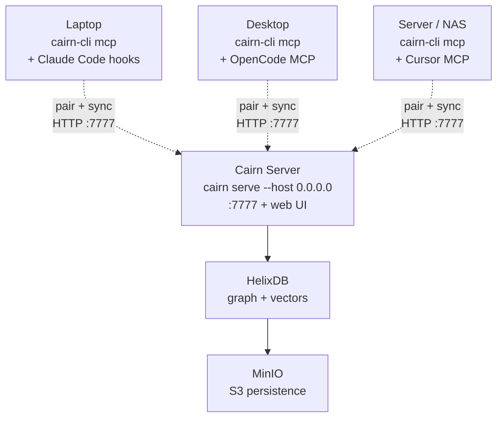

<div align="center">


# Cairn

### The open-source context & reliability layer for AI agents

**Make any model smart.** Remember everything · feed less, not more · stay reliable on long
tasks · get smarter together — self-hosted, with no context ever lost.

</div>

---

> A cairn is a stack of trail-marker stones. Travelers each add a stone, and everyone who follows
> benefits. Each coding session leaves a marker the next one follows (**memory**); a cairn is
> minimal — only the stones you need to navigate (**lean, no-loss context**).

Cairn sits between your AI coding agents (Claude Code, Codex, OpenCode, Cursor, …) and your code.
It runs as one small server you self-host once, and every device + agent connects to it through a
single MCP endpoint plus lifecycle hooks.



## Why

AI agents fail on long, multi-session work in ways bigger context windows don't fix:

- They **forget everything** between sessions.
- They **re-read files** they already read, burning tokens.
- Quality **decays over long tasks** (context rot, reasoning drift, silent corruption).
- Memory is **siloed** per machine and per tool.

The bottleneck usually isn't the model's IQ — it's the **context fed to it** and the **drift over
time**. Cairn fixes that.

## The five pillars

## The five pillars



1. **Remember** — decisions, tasks, and rationale persist across sessions, devices, and agents.
2. **Compress without loss** — files, shell output, and responses shrink in the window but stay
   fully recoverable (`expand`/`recover`). Cairn keeps the full-fidelity original; the agent gets
   a compact view + a handle.
3. **Assemble lean context** — fight context rot by feeding *less*, higher-signal, well-ordered
   context under a token budget.
4. **Stay reliable** — verify agent edits against retained originals, snapshot/rollback tracked
   files, and keep a task anchor on long tasks (active guardrails).
5. **Get smarter together** — learn your preferences and opt into a sanitized, federated
   **collective knowledge** pool so cheap/small models behave like senior, personalized engineers.

## Proof

Run **`cairn-cli bench`** on your own repo to see the savings. Measured on Cairn's own `crates/` (25 files):



| Mechanism | Before | After | Saved |
|---|---|---|---|
| AST outline reads (feed code as structure) | ~59,052 tok | ~5,894 tok | **90%** |
| Re-reading an unchanged file | ~6,506 tok | ~19 tok | **99.7%** |
| Shell output (a verbose test log) | 153 lines | 1 line | **99%** |

All of it is lossless — the full original is retained and one `expand` away.

## Status

🚧 Active development — the engine is functional today (memory, no-loss compression, context
assembly, edit guardrails + reliability score, shell compression, preference learning,
privacy-first sanitization, a federated collective-knowledge pool, and multi-device sync).
**HelixDB** (graph + vectors) is Cairn's datastore, with hybrid recall — HNSW vector search fused
with BM25. Point `CAIRN_HELIX_URL` at a HelixDB server, or use the bundled `docker compose` stack,
which runs one for you. See [the design plan](docs/PLAN.md).

This repo is a Cargo workspace:

| Crate | Role |
|---|---|
| `cairn-core` | shared domain types, hashing, config |
| `cairn-store` | HelixDB graph+vector store (the `StoreBackend`) + content-hash blob store |
| `cairn-context` | cached reads · AST signature outlines (11 languages) · byte-identical `expand` |
| `cairn-memory` | remember · BM25 recall · wakeup · Ebbinghaus decay · 4-tier consolidation |
| `cairn-assemble` | token-budgeted, edge-ordered context assembler (anti-rot) |
| `cairn-guard` | verify edits vs originals · task anchor · checkpoint/rollback · reliability score |
| `cairn-shell` | RTK-style command-output compression (lossless via `expand`) |
| `cairn-profile` | preference learning — inject how you work |
| `cairn-share` | privacy-first sanitization — redact secrets/PII, classify shareable/review/private |
| `cairn-mcp` | MCP server (stdio) — local HelixDB or remote HTTP proxy |
| `cairn-api` | axum REST API + embedded web UI |
| `cairn-server` | the `cairn` binary (serve, token, pair-code) |
| `cairn-cli` | the `cairn-cli` binary (setup, mcp, run, hook, sync, …) |

## Install

```sh
# Linux / macOS — one-liner (downloads the latest release binary)
curl -fsSL https://raw.githubusercontent.com/Vellixia/Cairn/main/scripts/install.sh | sh

# Windows (PowerShell)
irm https://raw.githubusercontent.com/Vellixia/Cairn/main/scripts/install.ps1 | iex

# Docker — the full stack (Cairn + HelixDB), the easiest path
docker compose up -d

# From source
cargo install --git https://github.com/Vellixia/Cairn cairn-server cairn-cli
```

Cairn stores its data in **HelixDB**, so `cairn serve` needs `CAIRN_HELIX_URL` set (or use the
`docker compose` stack above, which starts one and wires it up). See
[Self-host with Docker](#self-host-with-docker).

Then run `cairn serve` and open <http://127.0.0.1:7777>. The `cairn` binary is the server; `cairn-cli` is the client that connects agents and runs local tools.

## Topology: one server, many devices

Cairn is **server + clients**. Run one Cairn server where it's always reachable (a home server,
NAS, VPS, or `docker compose up`); each personal device runs `cairn-cli` (its own store, MCP, and
hooks) and **pairs/syncs to the server's URL**.



```sh
# On the server — expose it on the network and note its URL, e.g. http://192.168.1.10:7777
cairn serve --host 0.0.0.0           # or set CAIRN_HOST=0.0.0.0 in .env
cairn pair-code                      # prints a short, single-use pairing code

# On a personal device — point it at the server once
cairn-cli pair <code> --server http://192.168.1.10:7777
# now `cairn-cli sync --server http://192.168.1.10:7777` (or just `cairn-cli sync` if CAIRN_SERVER is set)
```

The **dashboard works at the server's URL out of the box** — open `http://192.168.1.10:7777` and the
UI talks to that same origin (no rebuild, no hardcoded localhost).

## Self-host with Docker

The recommended production setup is the bundled stack — one command brings up Cairn backed by a
persistent **HelixDB**:

```sh
cp .env.example .env        # REQUIRED — MinIO credentials must be set (see .env.example)
docker compose up -d        # builds Cairn, pulls HelixDB + MinIO, wires them together
```

Five services come up:

| Service | Role | Address |
|---|---|---|
| `cairn` | server + dashboard | <http://localhost:7777> |
| `helix` | HelixDB graph + vector datastore (Cairn's backend) | <http://localhost:6969> |
| `minio` | S3 storage HelixDB persists to (survives restarts) | <http://localhost:9001> (console) |
| `minio-init` | one-shot: creates HelixDB's bucket, then exits | — |
| `minio-guard` | one-shot: refuses to boot if MinIO credentials are missing or insecure | — |

Cairn reaches Helix over the compose network (`CAIRN_HELIX_URL=http://helix:8080`, set for you).
The Cairn image is built with in-process **local embeddings** (`all-MiniLM-L6-v2`), so semantic
memory works with no API key; for a leaner image build with `--build-arg CAIRN_FEATURES=""` and set
a hosted `CAIRN_EMBED_PROVIDER`. Tune host ports and storage credentials in `.env` (`HELIX_PORT`,
`CAIRN_PORT`, `MINIO_ROOT_USER`, `MINIO_ROOT_PASSWORD`).

Already running HelixDB elsewhere? Skip the bundled services and point Cairn at it —
`CAIRN_HELIX_URL=http://your-helix:6969 cairn serve` — instead of `docker compose up`.

## Configuration (`.env`)

Settings resolve **CLI flag > real env > project `.env` > global `.env` > built-in default**.
`cairn-cli` loads both `.env` files at startup via `dotenvy` (see
`crates/cairn-cli/src/main.rs`); `dotenvy` only fills variables that are not already set, so a
real env var always wins over a project `.env`, and a project `.env` always wins over the global
one. Copy `.env.example` to a project `.env` or to a machine-global
`~/.config/cairn/.env` ("global cairn", applies to every project on this device):

| Variable | What |
|---|---|
| `CAIRN_DATA_DIR` | data directory (default: OS data dir; `/data` in Docker) |
| `CAIRN_HOST` · `CAIRN_PORT` | serve bind address (default `127.0.0.1:7777`) |
| `CAIRN_SERVER` | default server URL for `sync` / `pull` / `contribute` |
| `CAIRN_HELIX_URL` | HelixDB server URL — **required** (the `docker compose` stack sets it for you) |
| `CAIRN_HELIX_NS` | label-namespace prefix on the Helix backend; isolates multiple Cairn instances (default `cairn_`) |
| `CAIRN_SECRET_KEY` | 32+ byte HS256 key for signing device-token JWTs — **required** for production |
| `CAIRN_TLS_CERT` · `CAIRN_TLS_KEY` | PEM cert+key for HTTPS — **required** when binding to a non-loopback address |
| `CAIRN_WORKSPACE_ROOT` | restrict file reads/writes to this directory (path traversal guard) |
| `CAIRN_CORS_ORIGINS` | comma-separated allowed CORS origins (default: same-origin only) |
| `CAIRN_EMBED_PROVIDER` · `_MODEL` · `_URL` · `_API_KEY` | embedding model (default: local `all-MiniLM-L6-v2`) |
| `GITHUB_TOKEN` · `CAIRN_GITHUB_TOKEN` | optional. Lifts the GitHub API rate limit for `cairn update` (`CAIRN_GITHUB_TOKEN` wins if both are set) |
| `HELIX_PORT` · `MINIO_ROOT_USER` · `MINIO_ROOT_PASSWORD` | (compose only) host Helix port and MinIO credentials |
| `CAIRN_REPO` · `CAIRN_INSTALL_DIR` | (install script only) override the GitHub repo to install from and the install location |

## Quickstart (dev)

```sh
# Cairn needs a HelixDB — start just that service, or point at any HelixDB server.
docker compose up -d helix
CAIRN_HELIX_URL=http://localhost:6969 cargo run -p cairn-server -- serve
# server + API on http://127.0.0.1:7777
```

The landing page + operational control plane live in `web/` (Next.js, static-exported so the
binary can embed it):

```sh
cd web && npm install && npm run dev   # http://localhost:3000 (talks to the API on :7777)
```

## Connect an agent (MCP)

Cairn speaks the Model Context Protocol over stdio — point any MCP-capable agent at
`cairn-cli mcp`.

The fastest path is **`cairn-cli setup claude-code`**, which non-destructively wires up the MCP
server **and** the lifecycle hooks into `.mcp.json` and `.claude/settings.json`:
`SessionStart` injects your preferences + memory + current task; `UserPromptSubmit` assembles
relevant context and learns preferences; `PostToolUse` guards edits against silent corruption;
`SessionEnd` consolidates memory.

**Claude Code — one-step plugin:** instead of `cairn-cli setup`, run `/plugin marketplace add
Vellixia/Cairn` then `/plugin install cairn@cairn` to bundle the MCP server, all four lifecycle
hooks, slash commands (`/cairn:recall`, `/cairn:remember`, `/cairn:sanitize`, `/cairn:bench`), and
usage guidance in a single install. (Install the `cairn` and `cairn-cli` binaries first.)

Using another editor? `cairn-cli setup cursor`, `cairn-cli setup vscode`, `cairn-cli setup windsurf`,
and `cairn-cli setup opencode` each wire up the MCP server in that agent's own config format
(MCP only — they have no hook system). Or run **`cairn-cli setup --all`** to auto-detect every
agent present and configure each. Every setup is non-destructive and idempotent.

To connect to a remote server, pass `--server` and `--token`:

```sh
cairn-cli setup claude-code --server http://192.168.1.10:7777 --token <token>
```

This writes an MCP config that sets `CAIRN_SERVER` and `CAIRN_TOKEN` in the MCP server's
environment, so `cairn-cli mcp` runs in remote-proxy mode (no local HelixDB needed on the device).

To do it by hand: run `claude mcp add cairn -- cairn-cli mcp`, or add an `.mcp.json`:

```json
{
  "mcpServers": {
    "cairn": { "command": "cairn-cli", "args": ["mcp"] }
  }
}
```

For a remote server by hand:

```json
{
  "mcpServers": {
    "cairn": {
      "command": "cairn-cli",
      "args": ["mcp"],
      "env": { "CAIRN_SERVER": "http://192.168.1.10:7777", "CAIRN_TOKEN": "<token>" }
    }
  }
}
```

Tools exposed: `read`, `expand`, `remember`, `recall`, `wakeup`, `consolidate`, `assemble`,
`prefer`, `profile`, `anchor`, `checkpoint`, `rollback`, `checkpoints`, `verify`, `compress`,
`sanitize`.
During dev, use `cargo run -p cairn-cli -- mcp` as the command.

## Commands

The `cairn` binary (server):

| Command | What it does |
|---|---|
| `cairn serve` | start the server + embedded web UI (`http://127.0.0.1:7777`) |
| `cairn token create <name>` | create a signed JWT device token (requires `CAIRN_SECRET_KEY`) |
| `cairn token list` · `cairn token revoke <token>` | manage device tokens |
| `cairn pair-code [name]` | generate a short, single-use pairing code for a new device |
| `cairn doctor` | verify the server-side setup |

The `cairn-cli` binary (client):

| Command | What it does |
|---|---|
| `cairn-cli mcp` | run the MCP server over stdio (local HelixDB or remote proxy via `CAIRN_SERVER`) |
| `cairn-cli setup [agent]` · `cairn-cli setup --all` | wire up MCP + instructions file (+ hooks for Claude Code); `--all` auto-detects |
| `cairn-cli setup --server <url> --token <t>` | configure agents to talk to a remote Cairn server |
| `cairn-cli rules [agent]` · `cairn-cli rules --all` | (re)write per-agent instructions that tell the model to use Cairn's tools |
| `cairn-cli run -- <cmd>` | run a command, print **compressed** output (full output retained) |
| `cairn-cli remember <text>` · `cairn-cli recall <query>` | store / search memory |
| `cairn-cli prefer <rule>` | record a standing preference (e.g. `cairn-cli prefer always use ripgrep`) |
| `cairn-cli anchor <goal>` | set the current task goal (re-injected at session start) |
| `cairn-cli checkpoint [label]` · `cairn-cli rollback <id>` · `cairn-cli checkpoints` | snapshot / restore tracked files |
| `cairn-cli sync --server <url> --token <t>` | multi-device sync (last-write-wins) |
| `cairn-cli pair <code> --server <url>` | onboard this device with a short code (no token copying) |
| `cairn-cli export <file>` · `cairn-cli import <file>` | move memory between machines offline |
| `cairn-cli export --share <file>` | export a sanitized, shareable bundle |
| `cairn-cli import --share <file>` | ingest a shared bundle |
| `cairn-cli contribute --server <url>` · `cairn-cli pull --server <url>` | federate sanitized knowledge with a shared pool |
| `cairn-cli bench [path]` | measure the token savings on a codebase |
| `cairn-cli update` | self-update the binaries to the latest GitHub release |
| `cairn-cli doctor` | verify the local setup |

## Multi-device & sync

Run one Cairn server for all your devices, or keep a server per device and sync between them.

- **Tokens:** `cairn token create <name>` prints a signed JWT device token (requires `CAIRN_SECRET_KEY`).
  Once any token exists, `/api/*` requires `Authorization: Bearer <token>` (the web UI and `/api/health` stay open).
  The bearer value is never stored — only the token id and metadata are persisted. Local-only
  setups on loopback need no tokens.
- **Pairing:** on the host run `cairn pair-code` (or click *Generate pairing code* in the
  dashboard) for a short, single-use code; on the new device run
  `cairn-cli pair <code> --server http://host:7777`. It claims a device token (no long secret to copy),
  stores it, and runs the first sync. The claim endpoint is the only open `/api/*` route — the
  short-lived code is the credential.
- **Sync:** `cairn-cli sync --server http://host:7777 --token <token>` pulls remote changes then
  pushes local ones (last-write-wins on `updated_at`). After pairing, the token is remembered, so
  `cairn-cli sync --server http://host:7777` alone works.
- **Offline move:** `cairn-cli export dump.json` / `cairn-cli import dump.json` copies memory between
  machines with no network.

## License

Apache-2.0. See [LICENSE](LICENSE).
