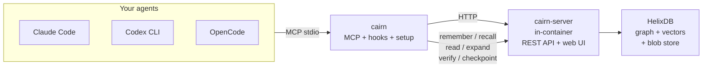

<div align="center">


# Cairn

### The open-source context & reliability layer for AI agents

**Make any model smart.** Remember everything - feed less, not more - stay reliable on long
tasks - get smarter together - self-hosted, with no context ever lost.

</div>

---

> A cairn is a stack of trail-marker stones. Travelers each add a stone, and everyone who follows
> benefits. Each coding session leaves a marker the next one follows (**memory**); a cairn is
> minimal - only the stones you need to navigate (**lean, no-loss context**).

Cairn sits between your AI coding agents (Claude Code, Codex CLI, OpenCode) and your code.
It runs as one small server you self-host once via Docker, and every device + agent connects to
it through a single MCP endpoint plus lifecycle hooks.



## Why

AI agents fail on long, multi-session work in ways bigger context windows don't fix:

- They **forget everything** between sessions.
- They **re-read files** they already read, burning tokens.
- Quality **decays over long tasks** (context rot, reasoning drift, silent corruption).
- Memory is **siloed** per machine and per tool.

The bottleneck usually isn't the model's IQ - it's the **context fed to it** and the **drift over
time**. Cairn fixes that.

## Features

### Memory

- **Cross-session recall** - decisions, findings, and rationale from last week are visible today, ranked by confidence x relevance.
- **4-tier memory** - working -> episodic -> semantic -> procedural. Memories consolidate and crystallize over time.
- **Provenance graph** - every memory tracks `derived_from`, `contradicts`, `supersedes`, and `applies_to` edges. The dashboard renders the full graph.
- **Confidence reinforcement** - the agentmemory curve `c' = min(1.0, c + 0.1*(1-c))` on every successful recall. Pinned memories bypass decay.
- **Proactive recall** - an intent classifier runs before each agent turn and auto-injects up to 3 relevant memories when the prompt has recall cues. Per-project opt-out.
- **Hybrid search** - BM25 lexical + semantic vector recall fused via Reciprocal Rank Fusion, with MMR diversity reranking (Î>>=0.7).
- **Multi-tenant** - every memory carries an `OrgId`. Tenant isolation enforced before any ranking work. Single-tenant installs see no change.

### Context compression

- **AST-aware reads** - tree-sitter outlines for 11 languages (rust, python, javascript, typescript, go, c, cpp, java, c#, ruby, bash). A 3,200-token file becomes ~210 tokens. The full original is one `expand` away.
- **Cache-aware re-reads** - unchanged files cost ~19 tokens (just the handle). No context ever lost.
- **Shell compression** - verbose command output (153 lines) compresses to 1 line, fully recoverable.
- **Token-budget assembly** - edge-ordered context assembly under a budget. Anti-context-rot.

### Reliability

- **Edit verification** - compares proposed edits against the retained original. Flags large unreplaced deletions (silent corruption).
- **Checkpoint / rollback** - snapshot tracked files before risky edits. One command undoes damage.
- **Task anchor** - the current goal is re-injected at session start so the model doesn't drift.
- **Drift detection** - sessions record checkpoints; the dashboard surfaces drift for review + approval.
- **HMAC-signed savings ledger** - every context assembly is signed. `/api/ledger/verify` detects tampering.

### Collaboration

- **`.cairnpkg` format** - share memory packs as signed tarballs. Ed25519 signatures. Per-file SHA-256 integrity.
- **Self-hosted registry** - publish, search, install, revoke packs via `/registry/*` HTTP endpoints. Trust scopes (Local / Team / Public).
- **Federation** - pull-based revocation propagation. Offline-first CRDT sync (GCounter + ORSet + vector clocks).
- **E2E encrypted sync** - Argon2id -> ChaCha20-Poly1305 AEAD. The server never sees plaintext.

### Platforms

- **PWA** - service worker for offline dashboard. Push notifications for drift events.
- **Transcript ingestion** - VTT / SRT / JSON parsers. Chunk by speaker + time window. Each chunk becomes a memory.
- **Browser extension capture** - `POST /api/extensions/capture` turns any selection into a Cairn memory.
- **Mobile companion** - `/mobile` PWA with biometric gate, savings card, drift-approval queue.

## Proof

Measured on Cairn's own `crates/` (25 files):

| Mechanism | Before | After | Saved |
|---|---|---|---|
| AST outline reads | ~59,052 tok | ~5,894 tok | **90%** |
| Re-reading an unchanged file | ~6,506 tok | ~19 tok | **99.7%** |
| Shell output (verbose test log) | 153 lines | 1 line | **99%** |

All lossless - the full original is retained and one `expand` away. See [Benchmarks](docs/testing/benchmarks.md).

## Getting started

### 1. Install

```sh
# macOS / Linux - one-liner (recommended)
curl -fsSL https://raw.githubusercontent.com/Vellixia/Cairn/main/scripts/install.sh | sh

# Windows (PowerShell)
irm https://raw.githubusercontent.com/Vellixia/Cairn/main/scripts/install.ps1 | iex
```

```sh
# Docker - the full stack (Cairn + HelixDB + MinIO), the easiest path
cp .env.example .env          # set MinIO + admin credentials (see .env.example)
docker compose up -d          # builds Cairn, pulls HelixDB + MinIO, wires them together
# -> http://localhost:7777
# First-boot admin is bootstrapped from CAIRN_ADMIN_USERNAME + CAIRN_ADMIN_PASSWORD.
# Comment out CAIRN_ADMIN_PASSWORD to fall back to the /setup wizard on first visit.
```

```sh
# From source (host binary only - the in-container server bin ships in the Docker image)
cargo install --git https://github.com/Vellixia/Cairn cairn
```

### 2. Start the server

`docker compose up -d` brings up Cairn + HelixDB + MinIO. The admin record
is bootstrapped from `CAIRN_ADMIN_USERNAME` + `CAIRN_ADMIN_PASSWORD` in
`.env` on first boot. See [docs/guides/admin.md](docs/guides/admin.md) for the full
admin surface (mint tokens, pair codes, password rotation).

### 3. Connect an agent

```sh
cairn setup --all         # auto-detect every installed agent and wire up MCP
# or target one:
cairn setup opencode --server http://localhost:7777 --token <token>
```

Supports Claude Code (MCP + lifecycle hooks), Codex CLI, and OpenCode.
See [Architecture - Connecting an agent](docs/reference/architecture.md#connecting-an-agent-by-hand) for manual setup.

### 4. Verify

```sh
cairn doctor              # checks server connectivity + agent config
cairn status              # shows server, token, and agent status
```

## OpenCode quickstart

OpenCode is a first-class citizen - `cairn` is one of its built-in providers.
The fastest path from `git clone` to a Cairn-aware session:

```sh
# 1. Install the CLI
curl -fsSL https://raw.githubusercontent.com/Vellixia/Cairn/main/scripts/install.sh | sh

# 2. Start the server stack
docker compose up -d                     # HelixDB + MinIO + Cairn on :7777

# 3. Wire OpenCode (creates ~/.config/opencode/opencode.json with the MCP entry)
cairn setup opencode --server http://localhost:7777

# 4. Generate a token (one-time, copy it).
# Mint a device token via the dashboard: open http://127.0.0.1:7777/settings/tokens
# and click "Mint token". The bearer appears once in the success toast.

# 5. Restart OpenCode so the MCP entry picks up. You'll see `cairn` in the tool list.
```

After that, OpenCode's tool palette includes `cairn_recall`, `cairn_remember`, `cairn_read`,
`cairn_verify`, `cairn_assemble`, `proactive_recall`, `memory_graph`, `memory_crystallize`,
`search`, `metrics`, and 30+ more - see [MCP tools](docs/reference/architecture.md#mcp-tool-surface).

### What Cairn gives OpenCode out of the box

- **Cross-session memory.** Decisions from last week are visible today via `cairn_recall`
  at session start, ranked by `confidence x applies_to`.
- **Lean file reads.** `cairn_read` returns the AST outline (~90% smaller than the full
  file); the original is one `cairn_expand` away. No context lost.
- **Drift detection.** Each session records checkpoints; `cairn doctor --fix`
  re-anchors the model on long tasks.
- **One-line rules.** The MCP `prefer` tool turns "always use ripgrep" into a memory that
  re-fires on every session until contradicted.
- **Proactive recall.** The intent classifier fires before each turn - if the prompt
  has recall cues, relevant memories are auto-injected. No manual recall needed.

## Status

šS Active development - v0.5.0 is feature-complete. See [Roadmap](docs/planning/roadmap.md) for
what's done and what's next.

## Where to go next

| I want to... | Read |
|---|---|
| Install & operate the server | [docs/guides/admin.md](docs/guides/admin.md) |
| Upgrade an existing install | [docs/guides/upgrading.md](docs/guides/upgrading.md) |
| Understand how it works | [docs/reference/architecture.md](docs/reference/architecture.md) |
| Connect my AI tool / IDE | [docs/guides/ide-integration.md](docs/guides/ide-integration.md) |
| Web dashboard & auth | [docs/guides/web-auth.md](docs/guides/web-auth.md) |
| See the roadmap / vision | [Roadmap](docs/planning/roadmap.md) / [Vision](docs/reference/vision.md) |
| Why decisions were made | [docs/reference/decisions.md](docs/reference/decisions.md) (ADRs) |
| Measured token savings | [docs/testing/benchmarks.md](docs/testing/benchmarks.md) |
| Security policy | [SECURITY.md](SECURITY.md) |
| Browse the full docs library | [docs/README.md](docs/README.md) |

Release notes: [CHANGELOG.md](CHANGELOG.md). Contributing: [CONTRIBUTING.md](CONTRIBUTING.md).

## License

Apache-2.0. See [LICENSE](LICENSE).