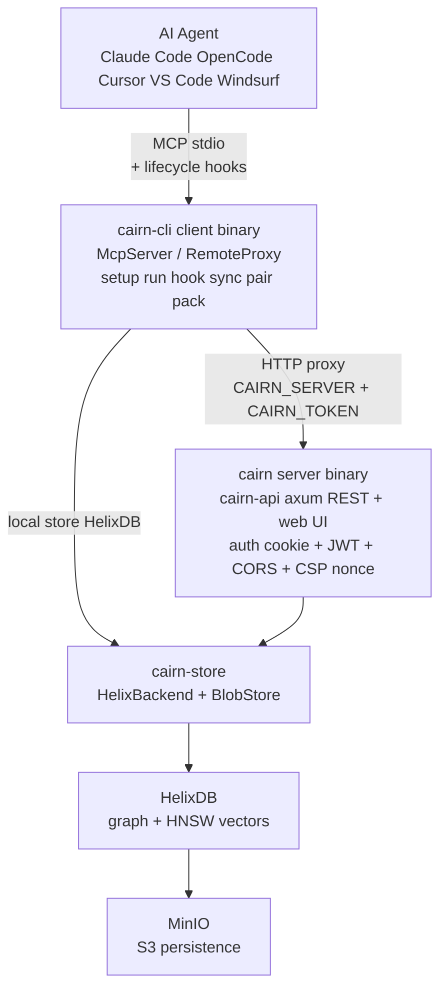
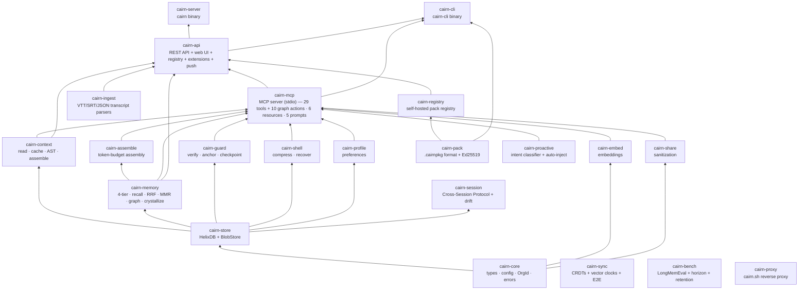

# Architecture

How Cairn is structured today — crate graph, data flow, MCP tool surface, API endpoints,
and Docker topology.

---

## System Overview



---

## Two Binaries

| Binary | Crate | Role |
|---|---|---|
| `cairn` | `cairn-server` | Server: `serve`, `token create/list/revoke`, `pair-code`, `admin password/reset` |
| `cairn-cli` | `cairn-cli` | Client: `mcp`, `setup`, `rules`, `run`, `hook`, `remember`, `recall`, `wakeup`, `prefer`, `anchor`, `checkpoint`, `rollback`, `sync`, `pair`, `export`, `import`, `contribute`, `pull`, `bench`, `update`, `doctor`, `onboard`, `pack`, `graph`, `memory`, `search`, `sessions`, `session`, `metrics`, `stats` |

---

## Cargo Workspace — 22 Crates

### Dependency Graph



### Crate Roles

| Crate | Role |
|---|---|
| `cairn-core` | Domain types, config resolution, errors, hashing, `OrgId`. No deps on other cairn crates. |
| `cairn-store` | HelixDB backend (graph + vector) + content-hash `BlobStore`. Token/memory/checkpoint/audit persistence. |
| `cairn-context` | Read modes (full/signatures/map/auto), content-hash + mtime cache (~13-tok re-reads), tree-sitter AST outlines (11 languages), `expand` recovery, `Assembler` (token-budgeted context). |
| `cairn-memory` | 4-tier memory (working/episodic/semantic/procedural), consolidation, Ebbinghaus decay, SHA-256 dedup, BM25 + semantic fusion via RRF, MMR diversity rerank, crystallize, provenance graph. |
| `cairn-assemble` | Edge-ordered context assembly under a token budget. Anti-context-rot. |
| `cairn-guard` | Verify edits vs originals, task anchor, checkpoint/rollback, reliability scoring. |
| `cairn-shell` | RTK-style command-output compression (filter/group/dedup), lossless via blob store. |
| `cairn-profile` | Preference/behavior learning, injected at session start. |
| `cairn-share` | Privacy-first sanitization: secret/PII detection, redaction, classification (shareable/review/private). |
| `cairn-embed` | Pluggable embeddings: local (fastembed/ONNX all-MiniLM-L6-v2), OpenAI, Ollama, hashing fallback. |
| `cairn-session` | Cross-Session Protocol (JSONL sessions + drift log), approve/reject workflow. |
| `cairn-pack` | `.cairnpkg` format — hand-rolled ustar, SHA-256 per-file integrity, HMAC signature, Ed25519 signing. |
| `cairn-registry` | Self-hosted pack registry: HTTP endpoints under `/registry/*`, trust scopes, revocation cascade. |
| `cairn-sync` | Offline-first CRDT sync: `GCounter` + `ORSet` + vector clocks + Argon2id/ChaCha20-Poly1305 E2E encryption. |
| `cairn-bench` | LongMemEval + horizon + retention benchmarks with hand-built fixtures. |
| `cairn-proactive` | Intent classifier (local heuristic, sub-ms), `ProactiveHook`, per-project opt-out. |
| `cairn-proxy` | `cairn.sh` reverse proxy: parallel fan-out to multiple registries, best-effort merge. |
| `cairn-ingest` | VTT/SRT/JSON transcript parsers + speaker-window chunking (default 60s). |
| `cairn-mcp` | MCP server over stdio. Local mode (opens HelixDB store) or remote proxy mode (forwards to `cairn-api`). 29 tools + 10 graph actions = 39, 6 resources, 5 prompts. |
| `cairn-api` | Axum REST API + embedded web UI (rust-embed). Auth middleware (cookie session + JWT device tokens), CORS, per-request CSP nonce. Registry + extensions + push + ingest routes. |
| `cairn-server` | The `cairn` binary: `serve`, `token`, `pair-code`, `admin`. |
| `cairn-cli` | The `cairn-cli` binary: `mcp`, `setup`, `run`, `hook`, `sync`, `pair`, `bench`, `pack`, `graph`, `memory`, `search`, `doctor`, `onboard`, etc. |

---

## MCP Tool Surface (29 tools + 10 graph actions = 39)

All tools are exposed via `cairn-cli mcp` (stdio) and mirrored at `/api/tools/list` + `/api/tools/call`.

| Category | Tools |
|---|---|
| **Context** | `read`, `expand` |
| **Memory** | `remember`, `recall`, `wakeup`, `consolidate`, `memory_edit`, `memory_delete`, `memory_pin`, `memory_promote`, `memory_reinforce`, `memory_timeline`, `memory_crystallize`, `memory_graph` |
| **Assembly** | `assemble` |
| **Guardrails** | `checkpoint`, `rollback`, `checkpoints`, `verify`, `anchor` |
| **Profile** | `prefer`, `profile` |
| **Shell** | `compress`, `run` |
| **Sanitization** | `sanitize` |
| **Graph** | `graph` (action: `related` / `impact` / `callgraph` / `symbol` / `routes` / `smells` / `index` / `architecture` / `refactor` / `benchmark`) |
| **Search** | `search` |
| **Metrics** | `metrics`, `stats` |
| **Sessions** | `sessions`, `session` |
| **Proactive** | `proactive_recall` |

### MCP Resources (6)

| URI | Description |
|---|---|
| `cairn://memory/graph` | Nodes + edges of the current memory graph |
| `cairn://memory/timeline` | Most recent memories, newest first |
| `cairn://savings/today` | Token-savings ledger summary for the last 24h |
| `cairn://drift/pending` | Drift events awaiting user review |
| `cairn://audit/recent` | Most recent audit events |
| `cairn://config/toml` | Effective server configuration as TOML |

### MCP Prompts (5)

| Name | Description |
|---|---|
| `summarize-drift` | Summarise pending drift items |
| `remember-decision` | Compose a `remember` tool call from a decision description |
| `what-do-we-know` | Boot a fresh-agent recap with top-3 memories |
| `weekly-savings-report` | Generate a Markdown weekly savings report |
| `drift-triage` | Walk through pending drift items for approval |

---

## API Endpoints

### Public (no auth)

| Method | Path | Description |
|---|---|---|
| GET | `/api/health` | Server health + version |
| POST | `/api/auth/login` | Admin login (sets `cairn_session` cookie) |
| POST | `/api/auth/logout` | Clear session cookie |
| GET | `/api/auth/me` | Current user info |
| POST | `/api/auth/setup` | First-run admin creation |
| GET | `/api/setup/health` | Setup wizard health check |

### Authenticated (cookie or bearer token)

| Method | Path | Description |
|---|---|---|
| GET | `/api/tools/list` | MCP tool definitions |
| POST | `/api/tools/call` | Dispatch a tool by name |
| POST | `/api/memory` | Store a memory |
| GET | `/api/search` | Hybrid search (BM25 + semantic) |
| GET | `/api/metrics` | Live cost-savings metrics |
| GET | `/api/events` | SSE event stream (with `Last-Event-ID` replay) |
| GET | `/api/ledger` | Savings ledger entries |
| GET | `/api/ledger/verify` | Verify HMAC chain integrity |
| GET | `/api/sessions` | List sessions |
| GET | `/api/sessions/:id` | Session detail |
| GET | `/api/drift` | Drift items (filter: `?status=pending`) |
| POST | `/api/drift/:id/approve` | Approve a drift item |
| POST | `/api/drift/:id/reject` | Reject a drift item |
| GET | `/api/devices/tokens` | List device tokens |
| POST | `/api/devices/tokens` | Create a device token |
| POST | `/api/devices/tokens/:id/revoke` | Revoke a device token |
| POST | `/api/devices/pair-codes` | Create a pairing code |
| GET | `/api/devices/audit` | Audit log |
| POST | `/api/push/subscribe` | Subscribe to push notifications |
| POST | `/api/push/unsubscribe` | Unsubscribe |
| GET | `/api/push/list` | List push subscriptions |
| POST | `/api/extensions/capture` | Browser extension capture (loopback-only) |
| POST | `/api/ingest/transcript` | Ingest a transcript (VTT/SRT/JSON) |

### Registry (`/registry/*`)

| Method | Path | Description |
|---|---|---|
| GET | `/registry/packs` | List all packs |
| POST | `/registry/packs` | Publish a pack (raw tarball) |
| GET | `/registry/packs/:name` | List versions of a pack |
| GET | `/registry/packs/:name/:version/download` | Download a pack tarball |
| GET | `/registry/packs/:name/:version/manifest.json` | Fetch cached manifest |
| DELETE | `/registry/packs/:name/:version` | Revoke a pack |
| GET | `/registry/search` | Search packs (`?q=...`) |
| GET | `/registry/trusted-keys` | List trust grants |
| GET | `/registry/revocations` | Revocation log (`?since=<unix>`) |

---

## Config Precedence

CLI flag > env var > project `.env` > `~/.config/cairn/.env` > built-in default.

| Env var | Default | Description |
|---|---|---|
| `CAIRN_DATA_DIR` | OS data dir | Data directory |
| `CAIRN_HOST` | `127.0.0.1` | Serve bind host |
| `CAIRN_PORT` | `7777` | Serve bind port |
| `CAIRN_HELIX_URL` | (none) | HelixDB server URL |
| `CAIRN_HELIX_TOKEN` | (none) | HelixDB bearer API key |
| `CAIRN_HELIX_NS` | `cairn_` | HelixDB label namespace prefix |
| `CAIRN_SECRET_KEY` | (required) | HMAC secret for JWTs (≥ 32 bytes) |
| `CAIRN_TLS_CERT` / `CAIRN_TLS_KEY` | (none) | TLS material for HTTPS |
| `CAIRN_INSECURE` | `0` | Allow plain HTTP on non-loopback |
| `CAIRN_WORKSPACE_ROOT` | (none) | Project root for context engine |
| `CAIRN_CORS_ORIGINS` | (empty) | Allowed CORS origins (comma-separated) |
| `CAIRN_EMBED_PROVIDER` | `local` | Embedding provider: `hashing` / `ollama` / `openai` |
| `CAIRN_ADMIN_USERNAME` | `admin` | Admin username |
| `CAIRN_ADMIN_PASSWORD` | (none) | Admin password (plaintext; loopback dev only) |
| `CAIRN_ADMIN_PASSWORD_HASH` | (none) | Admin password hash (Argon2id PHC; production) |
| `CAIRN_MULTI_TENANT` | `0` | Enable multi-tenant org isolation |
| `CAIRN_SERVER` | (none) | Remote cairn-server URL for `cairn-cli mcp` proxy mode |
| `CAIRN_TOKEN` | (none) | Bearer token for remote proxy mode |

---

## Docker Topology

```
docker compose up -d
  → minio-guard   (one-shot: validates MinIO creds)
  → minio         (S3-compatible storage for HelixDB persistence)
  → minio-init    (one-shot: creates helix-db bucket)
  → helix         (HelixDB graph + vector datastore, :6969)
  → cairn-init    (one-shot: chowns /data to uid 10001)
  → cairn         (Cairn server + web UI, 127.0.0.1:7777, non-root)
```

The `cairn` container runs as `user: "10001:10001"` (non-root). The `cairn-init`
one-shot chowns the `cairn-data` volume before the server starts.

---

## Connecting an agent by hand

### OpenCode

Add to `~/.config/opencode/opencode.json` or `.mcp.json` in the project root:

```json
{
  "mcpServers": {
    "cairn": {
      "command": "cairn-cli",
      "args": ["mcp"]
    }
  }
}
```

For remote mode, set `CAIRN_SERVER=http://<host>:7777` and `CAIRN_TOKEN=<token>`.

### Claude Code

Add lifecycle hooks to `.claude/settings.json`:

```json
{
  "hooks": {
    "SessionStart": [{ "hooks": [{ "command": "cairn-cli hook SessionStart", "type": "command" }] }],
    "SessionEnd": [{ "hooks": [{ "command": "cairn-cli hook SessionEnd", "type": "command" }] }],
    "PostToolUse": [{ "matcher": "Edit|Write|MultiEdit", "hooks": [{ "command": "cairn-cli hook PostToolUse", "type": "command" }] }]
  }
}
```

And add the MCP entry to `.mcp.json` (same as OpenCode above).

### Cursor

Add to `.cursor/mcp.json` (same JSON shape as OpenCode).

---

## See also

- [Plan v0.5.0](PLAN_v0.5.0.md) — 23-sprint plan, success metrics, risks
- [Benchmarks](BENCHMARKS.md) — measured token savings + methodology
- [Decisions](DECISIONS.md) — 26 ADRs
- [Roadmap](ROADMAP.md) — what's done, what's next
- [Security](../SECURITY.md) — threat model + hardening checklist
- [E2E Tests](E2E.md) — 20-scenario end-to-end test harness