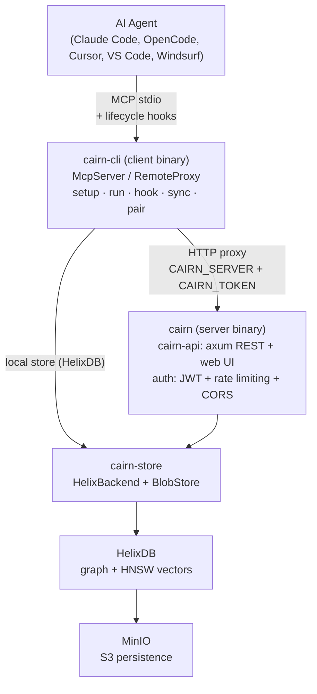
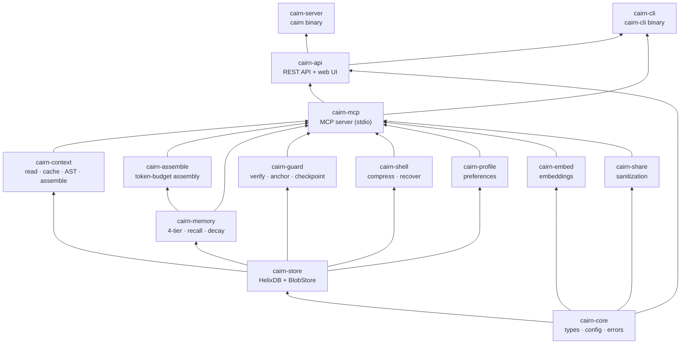
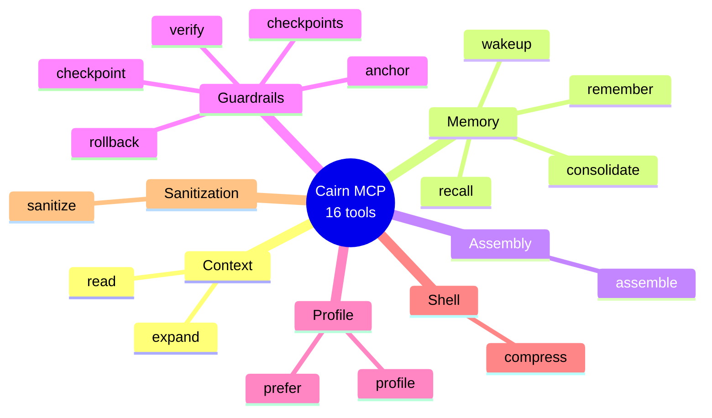
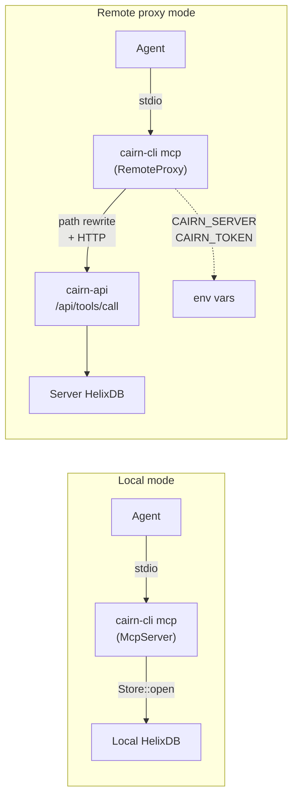
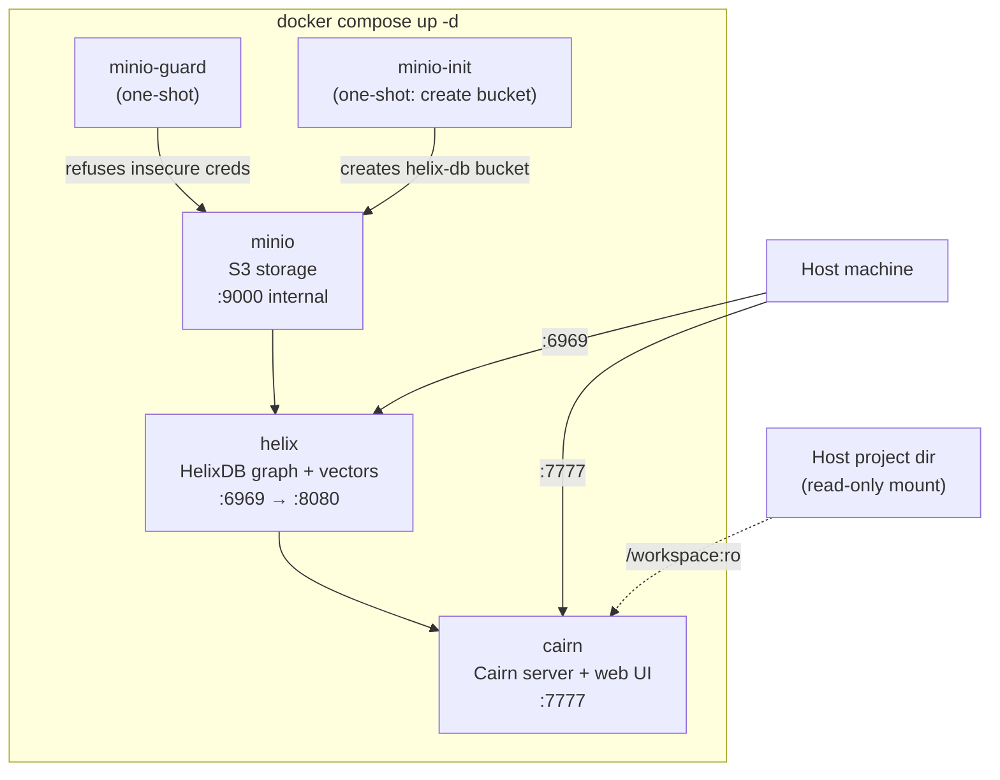
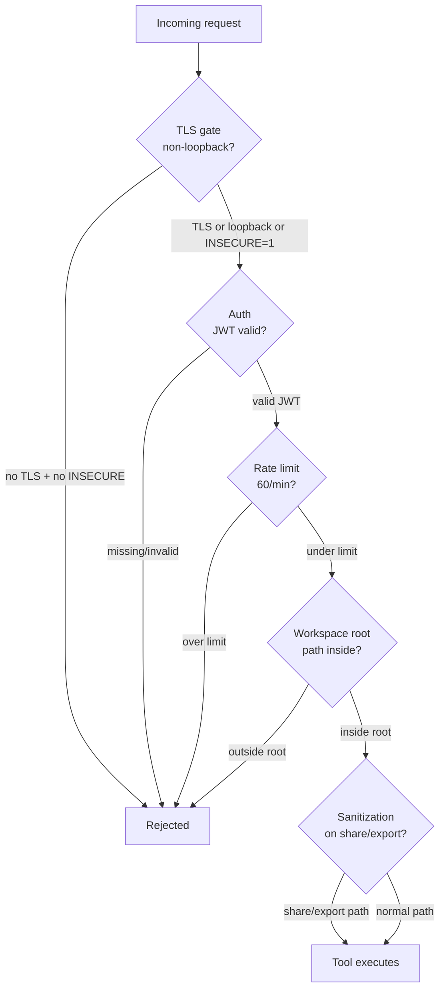

# Architecture

How Cairn is structured today — crate graph, data flow, MCP tool surface, API endpoints,
and Docker topology.

---

## System Overview



---

## Two Binaries

| Binary | Crate | Role |
|---|---|---|
| `cairn` | `cairn-server` | Server: `serve`, `token create/list/revoke`, `pair-code` |
| `cairn-cli` | `cairn-cli` | Client: `mcp`, `setup`, `rules`, `run`, `hook`, `remember`, `recall`, `prefer`, `anchor`, `checkpoint`, `rollback`, `sync`, `pair`, `export`, `import`, `contribute`, `pull`, `bench`, `update`, `doctor` |

---

## Cargo Workspace — 14 Crates

### Dependency Graph



### Crate Roles

| Crate | Role |
|---|---|
| `cairn-core` | Domain types, config resolution, errors, hashing. No deps on other cairn crates. |
| `cairn-store` | HelixDB backend (graph + vector) + content-hash `BlobStore`. Token/memory/checkpoint persistence. |
| `cairn-context` | Read modes (full/signatures/map/auto), content-hash + mtime cache (~13-tok re-reads), tree-sitter AST outlines (11 languages), `expand` recovery, `Assembler` (token-budgeted context). |
| `cairn-memory` | 4-tier memory (working/episodic/semantic/procedural), consolidation, Ebbinghaus decay, SHA-256 dedup, BM25 lexical recall. |
| `cairn-assemble` | Edge-ordered context assembly under a token budget. Anti-context-rot. |
| `cairn-guard` | Verify edits vs originals, task anchor, checkpoint/rollback, reliability scoring. |
| `cairn-shell` | RTK-style command-output compression (filter/group/dedup), lossless via blob store. |
| `cairn-profile` | Preference/behavior learning, injected at session start. |
| `cairn-share` | Privacy-first sanitization: secret/PII detection, redaction, classification (shareable/review/private). |
| `cairn-embed` | Pluggable embeddings: local (fastembed/ONNX all-MiniLM-L6-v2), OpenAI, Ollama, hashing fallback. |
| `cairn-mcp` | MCP server over stdio. Local mode (opens HelixDB store) or remote proxy mode (forwards to `cairn-api`). 16 tools. |
| `cairn-api` | Axum REST API + embedded web UI (rust-embed). Auth middleware (JWT device tokens), rate limiting, CORS, TLS. |
| `cairn-server` | The `cairn` binary: `serve`, `token`, `pair-code`. |
| `cairn-cli` | The `cairn-cli` binary: `mcp`, `setup`, `run`, `hook`, `sync`, `pair`, `bench`, `update`, `doctor`, etc. |

---

## MCP Tool Surface (16 tools)

All tools are exposed via `cairn-cli mcp` (stdio) and mirrored at `/api/tools/list` + `/api/tools/call`.



### Context (file operations)

| Tool | Description |
|---|---|
| `read` | Read a file through Cairn — cache-aware (auto mode), AST signatures, or full. Returns a compressed view + handle. |
| `expand` | Recover the byte-identical original for a handle/content hash returned by `read`. |

### Memory

| Tool | Description |
|---|---|
| `remember` | Save a durable memory (content, kind, tier, importance). |
| `recall` | Search memories by query, ranked by relevance + recency + importance. |
| `wakeup` | Session-start bootstrap: highest-value memories (decisions, tasks, preferences). |
| `consolidate` | Promote memories across tiers (working → episodic → semantic → procedural). |

### Context Assembly

| Tool | Description |
|---|---|
| `assemble` | Build a lean, edge-ordered working set under a token budget. Reports what's in/dropped. |

### Guardrails

| Tool | Description |
|---|---|
| `checkpoint` | Snapshot tracked files for rollback. Optional label. |
| `rollback` | Restore tracked files to a checkpoint's state. |
| `checkpoints` | List checkpoints (newest first) with their IDs. |
| `verify` | Compare proposed file content against the current version. Flags large unreplaced deletions. |
| `anchor` | Set or read the current task goal (re-injected at session start). |

### Profile

| Tool | Description |
|---|---|
| `prefer` | Record a standing user preference (stack, style, do/don'ts). |
| `profile` | Show recorded preferences (the profile block). |

### Shell

| Tool | Description |
|---|---|
| `compress` | Compress verbose command/tool output (cargo, git, build logs). Original retained via `expand`. |

### Sanitization

| Tool | Description |
|---|---|
| `sanitize` | Check text for secrets/PII before sharing/logging/committing. Redacts and classifies. |

---

## MCP Modes



### Local mode (default)
`cairn-cli mcp` opens the local store (`Store::open` → HelixDB). Requires `CAIRN_HELIX_URL`.
All tools run locally.

### Remote proxy mode
When `CAIRN_SERVER` is set, `cairn-cli mcp` runs `RemoteProxy` — forwards tool calls to the
remote Cairn server's HTTP API. No local HelixDB needed on the client device.

**Path rewriting:** For file tools (`read`, `verify`, `checkpoint`, `rollback`), the proxy
rewrites absolute host paths to workspace-relative paths before forwarding. The server has
the project mounted at `CAIRN_WORKSPACE_ROOT=/workspace`, so relative paths resolve correctly
inside the container.

---

## API Endpoints

All `/api/*` routes (except `/api/health` and `/api/pair/claim`) require `Authorization: Bearer
<jwt>` once any device token exists.

| Method | Path | Description | Auth |
|---|---|---|---|
| GET | `/api/health` | Health check | Open |
| GET | `/api/stats` | Server stats (memory count, reliability) | Required |
| GET | `/api/context/read` | Read a file (same as MCP `read`) | Required |
| GET | `/api/context/expand` | Expand a content hash | Required |
| GET | `/api/context/assemble` | Assemble context for a query | Required |
| POST | `/api/memory` | Remember a memory | Required |
| GET | `/api/memory/recall` | Recall memories | Required |
| GET | `/api/memory/wakeup` | Session-start bootstrap | Required |
| POST | `/api/memory/consolidate` | Consolidate tiers | Required |
| POST | `/api/guard/verify` | Verify file vs original | Required |
| GET/POST | `/api/guard/anchor` | Get/set task anchor | Required |
| POST | `/api/guard/checkpoint` | Create checkpoint | Required |
| GET | `/api/guard/checkpoints` | List checkpoints | Required |
| POST | `/api/guard/rollback` | Rollback to checkpoint | Required |
| POST | `/api/shell/compress` | Compress shell output | Required |
| GET/POST | `/api/profile` | Get/set preferences | Required |
| POST | `/api/share/sanitize` | Sanitize text | Required |
| GET | `/api/share/export` | Export memory bundle | Required |
| POST | `/api/share/import` | Import memory bundle | Required |
| POST | `/api/pool/contribute` | Contribute to shared pool | Required |
| GET | `/api/pool` | List shared pool | Required |
| GET | `/api/tools/list` | MCP tool surface (JSON) | Required |
| POST | `/api/tools/call` | Call an MCP tool via HTTP | Required |
| POST | `/api/pair/new` | Generate pairing code | Open |
| POST | `/api/pair/claim` | Claim a pairing code | Open |
| GET | `/api/sync/pull` | Pull remote changes | Required |
| POST | `/api/sync/push` | Push local changes | Required |

---

## Docker Topology



| Service | Image | Role | Port |
|---|---|---|---|
| `cairn` | `cairn:dev` (built) | Cairn server + web UI | 7777 |
| `helix` | `ghcr.io/helixdb/enterprise-dev` | HelixDB graph + vector datastore | 6969 → 8080 |
| `minio` | `minio/minio:latest` | S3 storage for HelixDB persistence | 9000 (internal) |
| `minio-init` | `minio/mc:latest` | One-shot: creates `helix-db` bucket | — |
| `minio-guard` | `alpine:3.19` | One-shot: refuses to boot with insecure MinIO creds | — |

### Key environment variables (compose)

| Variable | Value | Purpose |
|---|---|---|
| `CAIRN_HOST` | `0.0.0.0` | Bind on all interfaces (container) |
| `CAIRN_HELIX_URL` | `http://helix:8080` | HelixDB over compose network |
| `CAIRN_INSECURE` | `1` | Allow plain HTTP on non-loopback (local dev) |
| `CAIRN_WORKSPACE_ROOT` | `/workspace` | Project mount root for file tools |
| `CAIRN_TLS_CERT` / `CAIRN_TLS_KEY` | (not set in dev) | PEM cert+key for HTTPS |

### Volumes

| Volume | Mount | Purpose |
|---|---|---|
| `cairn-data` | `/data` | Cairn data dir (blobs, etc.) |
| `helix-minio` | `/data` (minio) | MinIO S3 data |

### Host project mount

The host project directory is mounted read-only at `/workspace` so `read`/`verify`/`checkpoint`
tools can access host files:

```yaml
volumes:
  - "${CAIRN_WORKSPACE_HOST:-.}:/workspace:ro"
```

---

## Security Boundaries



| Boundary | Mechanism |
|---|---|
| Workspace root | `CAIRN_WORKSPACE_ROOT` — `ContextEngine::resolve_path` rejects paths outside the root |
| Auth | JWT device tokens (HS256, signed with `CAIRN_SECRET_KEY`). Required once any token exists. |
| TLS gate | Refuses to serve HTTP on non-loopback unless `CAIRN_INSECURE=1` or TLS cert+key set |
| CORS | `CAIRN_CORS_ORIGINS` allow-list (default: same-origin only) |
| Rate limiting | 60 req/min per IP for API; 5 req/min for pairing claim |
| Sanitization | `cairn-share` redacts secrets/PII before any share/export/contribute |

---

## Config Resolution

Precedence (highest → lowest):

1. CLI flag (e.g. `--host`, `--port`, `--data-dir`)
2. Real environment variable
3. Project `.env` (repo root)
4. Global `.env` (`~/.config/cairn/.env`)
5. Built-in default

Key variables: `CAIRN_DATA_DIR`, `CAIRN_HOST`, `CAIRN_PORT`, `CAIRN_HELIX_URL`, `CAIRN_SECRET_KEY`,
`CAIRN_TLS_CERT`, `CAIRN_TLS_KEY`, `CAIRN_INSECURE`, `CAIRN_WORKSPACE_ROOT`, `CAIRN_CORS_ORIGINS`,
`CAIRN_EMBED_PROVIDER`, `CAIRN_EMBED_MODEL`, `CAIRN_EMBED_URL`, `CAIRN_EMBED_API_KEY`,
`CAIRN_SERVER`, `CAIRN_TOKEN`, `CAIRN_HELIX_NS`.

---

## See also

- [Plan](PLAN.md) — product vision and problem analysis
- [Roadmap](ROADMAP.md) — what's done, what's next
- [Decisions](DECISIONS.md) — key architecture decisions
- [Benchmarks](BENCHMARKS.md) — measured token savings