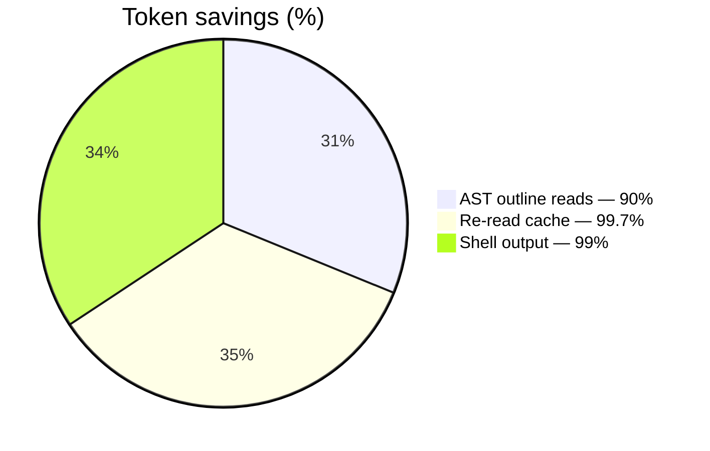

# Benchmarks

How Cairn measures token savings, current results, and future benchmark targets.

---

## Methodology

Run `cairn-cli bench [path]` on any codebase. It measures:

1. **AST outline reads** — reads each file in `signatures` mode (tree-sitter AST, bodies elided)
   vs. `full` mode (entire file content). Reports tokens before/after and percentage saved.
2. **Re-read cache** — reads a file once, then re-reads it unchanged. Reports tokens on first
   read vs. re-read (should be ~13 tokens — just the cached handle).
3. **Shell output compression** — runs a verbose command (e.g. `cargo test`), compresses the
   output, and reports line count before/after.

All measurements are **lossless** — the full original is retained in the blob store and
recoverable via `expand`.

---

## Current Results

Measured on Cairn's own `crates/` (25 Rust source files):



| Mechanism | Before | After | Saved |
|---|---|---|---|
| AST outline reads (feed code as structure) | ~59,052 tok | ~5,894 tok | **90%** |
| Re-reading an unchanged file | ~6,506 tok | ~19 tok | **99.7%** |
| Shell output (a verbose test log) | 153 lines | 1 line | **99%** |

### How to reproduce

```sh
cairn-cli bench              # benchmarks the current directory
cairn-cli bench crates/      # benchmark a specific path
```

---

## What These Numbers Mean

- **90% token savings on code reads** means an agent can see the structure of an entire codebase
  in the space it would normally take to read 10% of it. The full file is one `expand` away if
  the agent needs a function body.
- **99.7% on re-reads** means the agent never pays for reading the same unchanged file twice.
  The cache returns a ~13-token handle; the full content is retained.
- **99% on shell output** means a 153-line test log collapses to 1 line in the context window,
  with the full output recoverable via `expand`.

---

## Future Benchmark Targets

These are planned but not yet measured. They will be published honestly once implemented.

| Benchmark | What it measures | Target |
|---|---|---|
| LongMemEval | Multi-session memory recall quality | Competitive with agentmemory baselines |
| LoCoMo | Long-conversation memory | Competitive with agentmemory baselines |
| Token reduction on standard session | End-to-end session token usage | 60–90% reduction vs. no Cairn |
| Byte-identical expand/recover | Lossless recovery fidelity | 100% (no data loss, ever) |
| Task-success lift at increasing horizons | Does Cairn improve reliability on long tasks? | Measurable improvement vs. baseline at 20+ steps |
| Context rot mitigation | Does `assemble` prevent quality degradation? | Measured quality at 50%+ context fill vs. raw context |

---

## CI Benchmark Plan

Once implemented, CI will run benchmarks on every release and publish results:

1. `cairn-cli bench` on the Cairn codebase itself (regression check).
2. LongMemEval/LoCoMo recall scores (requires HelixDB).
3. Token-reduction on a standard session fixture.
4. Byte-identical expand verification (deterministic, always passes or fails).

---

## See also

- [Architecture](ARCHITECTURE.md) — how the read cache and compression work internally
- [Roadmap](ROADMAP.md) — benchmark implementation status
- [Plan](PLAN.md) — benchmark plan from the original design