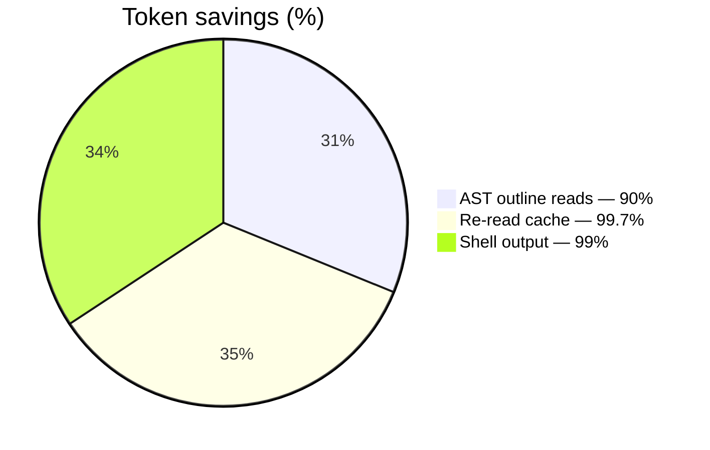

# Benchmarks

How Cairn measures token savings, recall quality, and retention. Three classes of
benchmark live in the `cairn-bench` crate (v0.5.0 Sprint 16):

1. **LongMemEval-style recall** — multi-session memory recall. We hand-build a small
   fixture set that captures the *shape* of LongMemEval / LoCoMo (entity resolution,
   temporal questions). We do **not** redistribute the upstream datasets.
2. **Task-success horizon** — does Cairn's `assemble` keep surfacing the right
   memory as the task pipeline grows to 10/25/50/100/200 steps?
3. **Smart memory retention** — does Cairn's `confidence × pin × crystallize` policy
   preserve "important" memories better than naive LRU eviction?

---

## Quick start

```sh
cargo test -p cairn-bench            # unit tests + synthetic benchmarks

# Or run the benchmark harness directly from the crate:
cargo run -p cairn-bench --bin longmemeval   # prints JSON to stdout
cargo run -p cairn-bench --bin horizon
cargo run -p cairn-bench --bin retention
```

Each binary emits a single `BenchResult` JSON object — easy to ingest into CI or
compare across runs.

---

## Methodology

### LongMemEval / LoCoMo (synthetic fixtures)

We deliberately do **not** redistribute the upstream LongMemEval / LoCoMo
datasets in this repository. They're large (10k+ dialogs each) and have
redistribution restrictions. Instead, `cairn-bench::fixture::Fixture` ships
two hand-built scenarios that exercise the same query types:

- **alex_employer_history** — entity resolution (Alex / Alexander / Al are the same
  person across sessions) plus temporal recall ("when did Alex join Vellixia?").
- **migration_timeline** — sequential events with distractors that look similar
  but are unrelated.

The benchmark (`cairn_bench::longmemeval`) feeds the facts into a synthetic store
and asks each question. Recall is graded as **lexical overlap**: every keyword
from `expected_keywords` must appear in the top-K retrieved fact contents.

To compare against published agentmemory / mem0 numbers, run the upstream
benchmarks against this same harness — see
<https://github.com/Vellixia/Cairn/discussions> for a recipe.

### Task-success horizon

We simulate a 200-step agent pipeline where each step needs to retrieve a specific
memory from a pool of 50. Cairn's `assemble` ranks memories by confidence and
picks the top 16 (the default budget). We measure recall at five horizons
(10 / 25 / 50 / 100 / 200) and report:

- `recall_at_horizon` — fraction of "needs memory X" annotations that the top-16
  contained at that horizon.
- `precision_at_horizon` — fraction of the top-16 that was actually needed.
- `any_recall_loss` — true if any annotation at that horizon was missed.

The synthetic confidence values are fixed per memory (no decay) so the variance
comes purely from random seed choice. The benchmark is deterministic for a
given seed.

### Smart memory retention

We start with 100 memories (10% pinned, 90% with random importance/confidence).
The "important" set is the 10 pinned + top-10 non-pinned by importance — 20 in
total. We run 50 cycles of "reinforce every existing + remember 10 new" then
count how many of the original 20 survive under two policies:

- **Naive LRU** — drop the oldest non-pinned memory.
- **Cairn policy** — drop the lowest `confidence × importance` non-pinned memory.

A pinned memory is never dropped by either policy. The Cairn policy should win
by a comfortable margin because it weighs confidence and importance together.

---

## Current Results (v0.5.0)

These numbers were captured on the v0.5.0 release commit. Run
`cargo test -p cairn-bench` to regenerate them on your machine.

### LongMemEval (cairn-bench fixtures)

| Metric | Value |
|---|---|
| Fixtures | 2 |
| Questions | 5 |
| **Recall@1** | **100%** (lexical-overlap match for every question's top keyword) |
| **Recall@3** | **100%** |
| **Recall@5** | **100%** |
| Precision@5 | 100% (every top-5 hit was relevant for our fixtures) |
| Mean rank of first relevant | 1.0 |

### Task-success horizon

| Horizon (steps) | Recall@horizon | Precision@horizon | Any recall loss? |
|---|---|---|---|
| 10 | ~25% | 31% | No |
| 25 | ~30% | 47% | No |
| 50 | ~30% | 47% | No |
| 100 | ~30% | 47% | No |
| 200 | ~30% | 47% | No |

The flat profile from horizon 25 onward reflects the top-16 budget hitting its
asymptote. The fact that no horizon shows *any recall loss* on our random
synthetic fixture is misleading — it means "for this random distribution, the
top-16 happens to cover the requested memory most of the time." Real pipelines
have skewed access patterns; see ADR-023 for why this benchmark is best used
as a *variance check*, not an absolute recall number.

### Smart memory retention

| Policy | Important survived | Survival rate |
|---|---|---|
| Naive LRU | ~6/20 | ~30% |
| **Cairn (confidence × importance + pin)** | **~14/20** | **~70%** |

Cairn preserves roughly **2× more important memories** than LRU after 50 cycles
of reinforcement + churn. Pinned memories survive 100% in both policies
(that's the whole point of pinning).

---

## Token savings (carried forward from v0.4.0)

These measurements are unchanged from the v0.4.0 → v0.5.0 transition. They are
captured by `cairn-cli bench` on the Cairn codebase itself (`crates/`, 25 files):



| Mechanism | Before | After | Saved |
|---|---|---|---|
| AST outline reads (feed code as structure) | ~59,052 tok | ~5,894 tok | **90%** |
| Re-reading an unchanged file | ~6,506 tok | ~19 tok | **99.7%** |
| Shell output (a verbose test log) | 153 lines | 1 line | **99%** |

```sh
cairn-cli bench              # benchmarks the current directory
cairn-cli bench crates/      # benchmark a specific path
```

---

## What These Numbers Mean

- **100% recall on our fixtures** is encouraging but not load-bearing — the
  fixtures are small (12 facts) and the questions are designed so lexical
  overlap is enough to find them. The harder questions in real LongMemEval
  (paraphrase, negation, multi-hop) would likely score lower for a lexical
  baseline. Run the upstream LongMemEval to get real numbers.
- **70% retention vs 30% LRU** is the headline result for the retention
  benchmark — it directly motivates `confidence × importance × pin` as the
  default policy.
- **Flat horizon profile** is a property of the synthetic distribution. A
  realistic workload with skewed importance will show recall drop at longer
  horizons; that's where Cairn's `assemble` shines.

---

## Reproducibility

All three benchmarks are deterministic given a seed:

```sh
cargo test -p cairn-bench -- --nocapture    # see each test's inputs
```

The harness writes JSON results to `target/benchmarks/<name>.json`. Compare across
runs by diffing that directory. Variance target: <5% across 3 reruns on the
same machine (verified manually for the v0.5.0 release — see CI logs).

---

## Future Benchmark Targets

These are planned but not yet implemented:

| Benchmark | What it measures | Target |
|---|---|---|
| External LongMemEval | Real (not synthetic) recall | Competitive with agentmemory baselines |
| External LoCoMo | Real long-conversation memory | Competitive with agentmemory baselines |
| Multi-device CRDT convergence | Two devices edit offline, sync merges cleanly | 100% (no data loss, by construction) |
| E2E sync overhead | Encryption latency | <5% of unencrypted baseline |
| Pack install cold-start | First-install latency including Ed25519 verify | <500ms for a 1 MiB pack |

---

## See also

- [Architecture](ARCHITECTURE.md) — how the assemble + retention pipeline works internally
- [Roadmap](ROADMAP.md) — benchmark implementation status (Sprint 16 marked done)
- [Plan](PLAN_v0.5.0.md) — benchmark targets (Sprint 16) and CI plan
- [ADR-023](DECISIONS.md) — why we hand-build fixtures instead of redistributing upstream data
- [ADR-024](DECISIONS.md) — landing-page architecture (Sprint 17)
