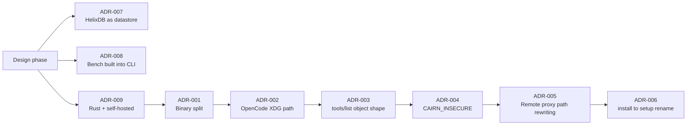

# Architecture Decision Records

Key decisions made during Cairn's development, with rationale. Ordered by recency.

---

## ADR-001: Binary split — `cairn` server + `cairn-cli` client

**Date:** 2026-06-18  
**Status:** Accepted

### Context
The original design called for a single `cairn` binary that handled both server operations
(`serve`, `token`, `pair-code`) and client operations (`mcp`, `setup`, `run`, `hook`, `sync`).
This created confusion: agents needed to install one binary but only use a subset of commands,
and the binary name collision made MCP config awkward (`command: ["cairn", "mcp"]` vs
`command: ["cairn-cli", "mcp"]`).

### Decision
Split into two binaries:
- **`cairn`** (crate `cairn-server`): server-only — `serve`, `token create/list/revoke`, `pair-code`.
- **`cairn-cli`** (crate `cairn-cli`): client-only — `mcp`, `setup`, `rules`, `run`, `hook`,
  `remember`, `recall`, `sync`, `pair`, `bench`, `update`, `doctor`.

### Rationale
- Clear separation of concerns: server runs once on a host, client runs on every device.
- MCP config is unambiguous: `command: ["cairn-cli", "mcp"]`.
- Smaller client binary (no server deps like axum-server).
- `cairn-cli update` updates only the client; server stays stable.

---

## ADR-002: OpenCode config path is XDG-style, not APPDATA

**Date:** 2026-06-18  
**Status:** Accepted

### Context
`cairn-cli setup opencode` initially wrote to `%APPDATA%\OpenCode\opencode.json` on Windows,
following the Windows convention. However, OpenCode on all platforms (including Windows) uses
`~/.config/opencode/opencode.json` (XDG-style). The setup was writing to the wrong path and
OpenCode never saw the cairn MCP entry.

### Decision
`opencode_config_path()` uses `XDG_CONFIG_HOME` or `USERPROFILE/.config/opencode/opencode.json`
on all platforms.

### Rationale
- OpenCode's `debug paths` confirmed `config: C:\Users\andre\.config\opencode`.
- Matching the actual path is the only way the setup works.

---

## ADR-003: MCP `tools/list` must return `{"tools": [...]}`, not a bare array

**Date:** 2026-06-18  
**Status:** Accepted

### Context
The `/api/tools/list` HTTP endpoint and the `RemoteProxy` initially returned a bare JSON array
of tool definitions. OpenCode's MCP client rejected this with "Failed to get tools" because the
MCP spec requires the result to be an object with a `tools` key.

### Decision
Both the HTTP endpoint and the proxy return `{"tools": [...]}`.

### Rationale
- MCP spec compliance.
- OpenCode (and other strict MCP clients) require the object shape.
- The local `McpServer` already did this correctly; only the HTTP/proxy path was wrong.

---

## ADR-004: `CAIRN_INSECURE=1` for local Docker HTTP dev

**Date:** 2026-06-18  
**Status:** Accepted

### Context
The server refuses to serve plain HTTP on non-loopback addresses (security default). Docker
Compose binds `0.0.0.0` inside the container (required for port mapping), so the server refused
to start without TLS. Generating self-signed certs added complexity for local dev.

### Decision
Added `CAIRN_INSECURE` env var. When `1`, the server allows plain HTTP on non-loopback with a
warning. Docker Compose sets it for local dev.

### Rationale
- Local Docker dev should be zero-config.
- Production users set up TLS (`CAIRN_TLS_CERT` + `CAIRN_TLS_KEY`) or a reverse proxy.
- The warning makes the tradeoff explicit in logs.

---

## ADR-005: Remote proxy path rewriting for file tools

**Date:** 2026-06-18  
**Status:** Accepted

### Context
In remote-proxy mode, `cairn-cli mcp` forwards all tool calls to the server. File tools (`read`,
`verify`, `checkpoint`, `rollback`) receive absolute host paths (e.g. `D:\code\Cairn\README.md`)
that don't exist inside the Docker container.

### Decision
1. Docker Compose mounts the host project read-only at `/workspace` with
   `CAIRN_WORKSPACE_ROOT=/workspace`.
2. `RemoteProxy` rewrites absolute host paths to workspace-relative before forwarding.

### Rationale
- File operations are inherently local — the files exist on the host, not the server.
- Mounting the project is the standard Docker dev pattern.
- Path rewriting is transparent to the agent — it sends normal paths, Cairn handles the rest.

---

## ADR-006: `install` renamed to `setup`

**Date:** 2026-06-18  
**Status:** Accepted

### Context
The original `cairn install <agent>` command was confusing because "install" implies installing
Cairn itself, not configuring an agent. It also didn't support `--server`/`--token` for remote
configuration.

### Decision
Renamed to `cairn-cli setup <agent>` with `--server` and `--token` flags. When `--server` is
provided, the MCP config includes `CAIRN_SERVER` and `CAIRN_TOKEN` env vars for remote-proxy mode.

### Rationale
- "setup" clearly means "wire up this agent to use Cairn".
- `--server`/`--token` enables one-command remote setup: `cairn-cli setup opencode --server http://... --token ...`.

---

## ADR-007: HelixDB as datastore (not SQLite/Postgres)

**Date:** Design phase  
**Status:** Accepted

### Context
Cairn needs both structured storage (memories, tokens, checkpoints, metadata) and vector search
(semantic recall). Options: SQLite + sqlite-vec, Postgres + pgvector, or a dedicated
graph+vector DB.

### Decision
Use **HelixDB** — a graph + vector database with HNSW indexing and S3 persistence.

### Rationale
- One backend for graph queries (memory relationships, file versions) and vectors (semantic recall).
- Bundled in `docker compose` (zero-config for local dev).
- S3 persistence via MinIO survives container restarts.
- The `StoreBackend` trait abstracts it, so swapping backends later is possible.

---

## ADR-008: `cairn-cli bench` built into the CLI

**Date:** Design phase  
**Status:** Accepted

### Context
Token savings claims need proof. External benchmark tools add friction; users won't install
them just to verify claims.

### Decision
`cairn-cli bench [path]` measures token savings on any codebase and prints a table.

### Rationale
- Zero-setup proof — the binary already has the read/compress logic.
- Users can verify claims on their own code immediately.
- Honest numbers (not cherry-picked marketing).

---

## ADR-009: Rust + self-hosted, no cloud dependencies

**Date:** Design phase  
**Status:** Accepted

### Context
The agent-memory market is crowded with cloud-hosted, Python/TS libraries. Cairn's audience is
self-hosters who want control and privacy.

### Decision
Build in **Rust** as a single self-hostable binary. No cloud accounts, no telemetry, no external
API calls unless the user opts in (embedding provider).

### Rationale
- Privacy by default — nothing leaves the user's infrastructure.
- Single binary deployment (runs on a Raspberry Pi).
- Rust's performance + safety for a reliability-critical tool.
- Differentiates from cloud-locked competitors.

---

## See also

- [Architecture](ARCHITECTURE.md) — how these decisions manifest in the code
- [Roadmap](ROADMAP.md) — what's done, what's next
- [Audit Report](audits/REPORT.md) — security findings that informed several of these decisions