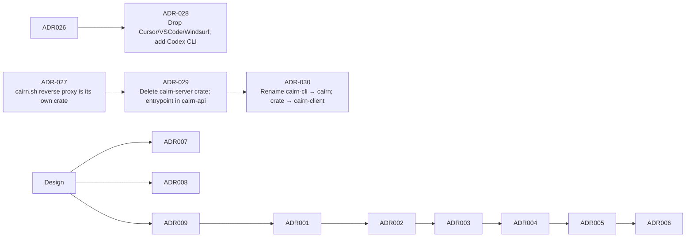

# Architecture Decision Records

Key decisions made during Cairn's development, with rationale. Ordered by recency.



---

## ADR-001: Binary split — `cairn` server + `cairn` client

**Date:** 2026-06-18  
**Status:** Accepted

### Context
The original design called for a single `cairn` binary that handled both server operations
(`serve`, `token`, `pair-code`) and client operations (`mcp`, `setup`, `run`, `hook`, `sync`).
This created confusion: agents needed to install one binary but only use a subset of commands,
and the binary name collision made MCP config awkward (`command: ["cairn", "mcp"]` vs
`command: ["cairn", "mcp"]`).

### Decision
Split into two binaries:
- **`cairn`** (crate `cairn-server`): server-only — `serve`, `token create/list/revoke`, `pair-code`.
- **`cairn`** (crate `cairn`): client-only — `mcp`, `setup`, `rules`, `run`, `hook`,
  `remember`, `recall`, `sync`, `pair`, `bench`, `update`, `doctor`.

> **Note (v0.5.0):** the subcommand list above is a snapshot from the v0.4.0
> ADR; the current `cairn` binary has grown to ~34 subcommands — see
> `crates/cairn/src/main.rs::Cmd` for the full enum.

### Rationale
- Clear separation of concerns: server runs once on a host, client runs on every device.
- MCP config is unambiguous: `command: ["cairn", "mcp"]`.
- Smaller client binary (no server deps like axum-server).
- `cairn update` updates only the client; server stays stable.

---

## ADR-002: OpenCode config path is XDG-style, not APPDATA

**Date:** 2026-06-18  
**Status:** Accepted

### Context
`cairn setup opencode` initially wrote to `%APPDATA%\OpenCode\opencode.json` on Windows,
following the Windows convention. However, OpenCode on all platforms (including Windows) uses
`~/.config/opencode/opencode.json` (XDG-style). The setup was writing to the wrong path and
OpenCode never saw the cairn MCP entry.

### Decision
`opencode_config_path()` uses `XDG_CONFIG_HOME` or `USERPROFILE/.config/opencode/opencode.json`
on all platforms.

### Rationale
- OpenCode's `debug paths` confirmed `config: C:\Users\andre\.config\opencode`.
- Matching the actual path is the only way the setup works.

---

## ADR-003: MCP `tools/list` must return `{"tools": [...]}`, not a bare array

**Date:** 2026-06-18  
**Status:** Accepted

### Context
The `/api/tools/list` HTTP endpoint and the `RemoteProxy` initially returned a bare JSON array
of tool definitions. OpenCode's MCP client rejected this with "Failed to get tools" because the
MCP spec requires the result to be an object with a `tools` key.

### Decision
Both the HTTP endpoint and the proxy return `{"tools": [...]}`.

### Rationale
- MCP spec compliance.
- OpenCode (and other strict MCP clients) require the object shape.
- The local `McpServer` already did this correctly; only the HTTP/proxy path was wrong.

---

## ADR-004: `CAIRN_INSECURE=1` for local Docker HTTP dev

**Date:** 2026-06-18  
**Status:** Accepted

### Context
The server refuses to serve plain HTTP on non-loopback addresses (security default). Docker
Compose binds `0.0.0.0` inside the container (required for port mapping), so the server refused
to start without TLS. Generating self-signed certs added complexity for local dev.

### Decision
Added `CAIRN_INSECURE` env var. When `1`, the server allows plain HTTP on non-loopback with a
warning. Docker Compose sets it for local dev.

### Rationale
- Local Docker dev should be zero-config.
- Production users set up TLS (`CAIRN_TLS_CERT` + `CAIRN_TLS_KEY`) or a reverse proxy.
- The warning makes the tradeoff explicit in logs.

---

## ADR-005: Remote proxy path rewriting for file tools

**Date:** 2026-06-18  
**Status:** Accepted

### Context
In remote-proxy mode, `cairn mcp` forwards all tool calls to the server. File tools (`read`,
`verify`, `checkpoint`, `rollback`) receive absolute host paths (e.g. `D:\code\Cairn\README.md`)
that don't exist inside the Docker container.

### Decision
1. Docker Compose mounts the host project read-only at `/workspace` with
   `CAIRN_WORKSPACE_ROOT=/workspace`.
2. `RemoteProxy` rewrites absolute host paths to workspace-relative before forwarding.

### Rationale
- File operations are inherently local — the files exist on the host, not the server.
- Mounting the project is the standard Docker dev pattern.
- Path rewriting is transparent to the agent — it sends normal paths, Cairn handles the rest.

---

## ADR-006: `install` renamed to `setup`

**Date:** 2026-06-18  
**Status:** Accepted

### Context
The original `cairn install <agent>` command was confusing because "install" implies installing
Cairn itself, not configuring an agent. It also didn't support `--server`/`--token` for remote
configuration.

### Decision
Renamed to `cairn setup <agent>` with `--server` and `--token` flags. When `--server` is
provided, the MCP config includes `CAIRN_SERVER` and `CAIRN_TOKEN` env vars for remote-proxy mode.

### Rationale
- "setup" clearly means "wire up this agent to use Cairn".
- `--server`/`--token` enables one-command remote setup: `cairn setup opencode --server http://... --token ...`.

---

## ADR-007: HelixDB as datastore (not SQLite/Postgres)

**Date:** Design phase  
**Status:** Accepted

### Context
Cairn needs both structured storage (memories, tokens, checkpoints, metadata) and vector search
(semantic recall). Options: SQLite + sqlite-vec, Postgres + pgvector, or a dedicated
graph+vector DB.

### Decision
Use **HelixDB** — a graph + vector database with HNSW indexing and S3 persistence.

### Rationale
- One backend for graph queries (memory relationships, file versions) and vectors (semantic recall).
- Bundled in `docker compose` (zero-config for local dev).
- S3 persistence via MinIO survives container restarts.
- The `StoreBackend` trait abstracts it, so swapping backends later is possible.

---

## ADR-008: `cairn bench` built into the CLI

**Date:** Design phase  
**Status:** Accepted

### Context
Token savings claims need proof. External benchmark tools add friction; users won't install
them just to verify claims.

### Decision
`cairn bench [path]` measures token savings on any codebase and prints a table.

### Rationale
- Zero-setup proof — the binary already has the read/compress logic.
- Users can verify claims on their own code immediately.
- Honest numbers (not cherry-picked marketing).

---

## ADR-009: Rust + self-hosted, no cloud dependencies

**Date:** Design phase  
**Status:** Accepted

### Context
The agent-memory market is crowded with cloud-hosted, Python/TS libraries. Cairn's audience is
self-hosters who want control and privacy.

### Decision
Build in **Rust** as a single self-hostable binary. No cloud accounts, no telemetry, no external
API calls unless the user opts in (embedding provider).

### Rationale
- Privacy by default — nothing leaves the user's infrastructure.
- Single binary deployment (runs on a Raspberry Pi).
- Rust's performance + safety for a reliability-critical tool.
- Differentiates from cloud-locked competitors.

---

## ADR-010: Durable audit log in HelixDB (not in-memory ring)

**Date:** 2026-06-20 (v0.5.0 Sprint 1)  
**Status:** Accepted

### Context
The pre-0.5.0 audit log was an in-memory ring buffer. Events vanished on restart, SSE replay
(`Last-Event-ID`) was unreliable, and the dashboard had to poll `/api/events` every 5 s.

### Decision
Persist audit events to **HelixDB** via an `AuditBackend` trait. The default impl is a
no-op (so offline tests don't need a backend); `HelixBackend` appends events as durable nodes
with monotonic integer ids. SSE replays from `max_event_id` and `recent_audit(since_id)`.

### Rationale
- Survives restarts — `audit_survives_round_trip_after_a_store_drop_and_reopen` test verifies.
- `Last-Event-ID` becomes reliable for UI reconnect without server-side state.
- NoSQL append-only schema is exactly what HelixDB is good at; no migration pain.
- Trait keeps the abstraction clean — a future Postgres backend can re-implement without
  touching the audit producer.

### Trade-offs
- One extra HelixDB write per audit event (~1-2 ms). Acceptable; audit is not on the hot path.
- Append-only schema means we can't physically delete rows; `get_meta_live` filters tombstone
  sentinels (`__deleted__`) instead.

---

## ADR-011: Memory `confidence` + `pinned` + provenance edges

**Date:** 2026-06-20 (v0.5.0 Sprint 2–3)  
**Status:** Accepted

### Context
Agentmemory's "reinforcement" curve (each access slightly raises confidence, asymptotic to 1.0)
is the right signal for "which memories should re-surface today?" — but pre-0.5.0 Cairn had no
confidence field, so recall used only lexical similarity. The memory graph (provenance: derived
from / contradicts / supersedes / applies_to) was also missing, so there was no way to express
"this crystallizes these three earlier notes."

### Decision
Add three things to `Memory`:
- `confidence: f32` (default 0.5) — bumped by the agentmemory formula
  `c' = min(1.0, c + 0.1*(1-c))` on every `reinforce()`.
- `pinned: bool` — never demoted by crystallize / decay passes; user-controlled.
- `derived_from`, `contradicts`, `supersedes`, `applies_to` — four `Vec<String>` columns of
  memory ids (or paths for `applies_to`).

Edges are stored as JSON-encoded columns on the `Memory` node, not as separate HelixDB graph
edges. The `MemoryEngine::graph()` method materializes a node+edge view from flat rows.

### Rationale
- Confidence gives recall a second axis to rank on (alongside lexical + applies_to).
- Pinned lets users mark "always show this" without writing a custom rule.
- Provenance edges enable `crystallize()` to derive a semantic-tier memory from working-tier
  inputs — the agentmemory "lesson" pattern.
- Storing edges as columns avoids HelixDB edge migrations when the edge schema evolves.

### Trade-offs
- `Memory` struct grew by 5 fields; tests that construct `Memory` literals need updating (caught
  by clippy in `extra.rs::graph_related_finds_memories_pointing_at_a_path`).
- `crystallize()` runs a single linear scan + one insert; fine up to ~10k memories, would need
  indexing past that.

---

## ADR-012: Sessions are on-disk JSONL, not HelixDB

**Date:** 2026-06-20 (v0.5.0 Sprint 4)  
**Status:** Accepted

### Context
"Sessions" track the per-task workflow: task list, drift events, approve/reject decisions. This
is operational metadata, not a queryable graph — there's no cross-session join, no vector
recall, no graph traversal needed.

### Decision
Store sessions as **JSON files under `<data_dir>/sessions/<id>.json`** and drift events as
**JSONL append-log under `<data_dir>/sessions/<id>.drift.jsonl`**. The new `cairn-session`
crate owns the read/write helpers and the patch schema.

### Rationale
- Append-only drift log mirrors the audit-log pattern (durability + replay), no migration.
- Single-file sessions are easy to back up, grep, and ship to support.
- Skipping HelixDB for operational metadata keeps the graph store focused on memories.

### Trade-offs
- No cross-session queries from the web UI yet (would need a separate index — Sprint 17 plans).
- Concurrent writers need an OS-level lock; we use `fs2` crate's `FileExt::lock_exclusive`.

---

## ADR-013: HMAC-SHA256 ledger for `context/assemble` runs

**Date:** 2026-06-20 (v0.5.0 Sprint 5)  
**Status:** Accepted

### Context
The savings dashboard needs a verifiable record of every context assembly: what was queried,
what was dropped, what was returned, how many tokens saved. Without signing, a malicious
extension could forge entries to inflate the savings number (or hide wasted context).

### Decision
Append-only ledger at `<data_dir>/ledger.jsonl` where each entry is:
```
{
  "ts": <unix_seconds>,
  "actor": "user|agent_name",
  "query_hash": "sha256:...",
  "budget": <int>,
  "drops": [<reason>...],
  "savings": { "tokens_in": N, "tokens_out": M, "saved_ratio": 0.0..1.0 },
  "mac": "hex(hmac_sha256(secret, canonical_json(entry_minus_mac)))"
}
```
Verification: recompute the canonical JSON, recompute the HMAC, compare. `cairn assemble`
also exposes `/api/ledger/verify` for the dashboard's "verify chain" button.

### Rationale
- HMAC-SHA256 is symmetric: fast, deterministic, no key infrastructure. The same
  `CAIRN_SECRET_KEY` already gates JWT device tokens.
- Canonical JSON (BTreeMap key-sorted, hand-rolled escape) avoids canonicalisation drift.
- Append-only JSONL is grep-friendly and easy to ship to S3 for long-term audit.

### Trade-offs
- A leaked `CAIRN_SECRET_KEY` can forge ledger entries (but can also forge everything else —
  the threat model already assumes the secret is the root of trust).
- No entry deletion; revocation = an explicit "voided" marker (Sprint 13 follow-up).

---

## ADR-014: `.cairnpkg` format adopted from lean-ctx `.ctxpkg`

**Date:** 2026-06-20 (v0.5.0 Sprint 11)  
**Status:** Accepted

### Context
Cairn needs a portable bundle format to ship context (memories, profile, patterns, edges)
between machines — and ideally to interoperate with the wider lean-ctx ecosystem.

### Decision
Adopt the lean-ctx `.ctxpkg` design with three changes:
1. Canonical extension is `.cairnpkg` (not `.ctxpkg`); `.ctxpkg` is accepted as an import
   alias for interop per plan §10.
2. Layout is fixed: `manifest.json` + `memory.jsonl` + `profile.jsonl` + `patterns.jsonl` +
   `graph.jsonl` + `signature.sha256`. No pax extensions, no symlinks.
3. SHA-256 per-file in the manifest; `signature.sha256` is HMAC-SHA256 over the canonical
   manifest bytes.

Hand-rolled ustar writer/parser (no `tar` crate dependency) keeps the binary lean and the
parsing code small (~200 lines).

### Rationale
- A fixed, minimal layout means every Cairn release can read every older `.cairnpkg`.
- lean-ctx interop lets the same bundle round-trip in either tool; useful for cross-team sharing.
- Per-file SHA-256 catches bit-rot and partial downloads; the HMAC signature catches wholesale
  substitution attacks.

### Trade-offs
- No compression in the tarball itself (matches `.ctxpkg`); the `MAX_UNCOMPRESSED_BYTES = 16 MiB`
  cap rejects pathological packs. A future "packed" variant can add zstd without breaking the
  existing format.
- No per-entry permissions, owners, or symlinks — we don't need them.

---

## ADR-016: Non-root Docker volume init (proper `cairn-init`)

**Date:** 2026-06-20 (v0.5.0 Sprint 12)  
**Status:** Accepted

### Context
The Docker image runs as the `cairn` user (uid 10001) but anonymous Docker volumes come up
owned by root. The pre-0.5.0 workaround was `user: "0"` on the cairn service, which meant the
server process ran with full root inside the container — an unnecessary privilege escalation
just to write a directory.

### Decision
Add a one-shot `cairn-init` service (alpine + `chown -R 10001:10001 /data`) that runs as root,
completes, then exits. The `cairn` service depends on `cairn-init: service_completed_successfully`
and runs as `user: "10001:10001"`.

### Rationale
- Init containers are the standard pattern for permission bootstrapping in compose / k8s.
- `restart: "no"` so a chown failure doesn't loop; the cairn service's own startup error
  surfaces the misconfiguration.
- Verifies with `stat -c %u /data` so a host-bind mount (which overrides the chown) fails
  fast with a useful message.

### Trade-offs
- One extra ~150 ms at first boot; negligible compared to the savings dashboard warm-up.
- A host-bind (`-v /host/path:/data`) still requires the host directory to be writable by
  uid 10001; the init container detects and fails fast.

---

## ADR-017: Ed25519 pack signatures (replace HMAC)

**Date:** 2026-06-20 (v0.5.0 Sprint 13)  
**Status:** Accepted

### Context
The pre-Sprint 13 `.cairnpkg` carried only a content-hash (`signature.sha256`) which
proved integrity but not authenticity — anyone with the tarball could claim to be the
author. Sharing between teams required trusting the registry URL as a proxy for
authenticity, which doesn't scale: a malicious registry can republish any unsigned
pack under its own author identity.

### Decision
Add an **Ed25519** signature alongside the existing SHA-256 hash:
- `Pack::write_tarball_signed(&mut self, path, &Keypair)` adds a `signature.ed25519`
  file and embeds the author's public key in `manifest.signers`.
- `cairn_pack::install::verify_ed25519_signature(entries, manifest_bytes, trusted_keys)`
  returns `Ok(true)` on match, `Ok(false)` for unsigned, `Err(Mismatch)` for
  signed-but-not-trusted.
- `cairn-pack::signing::{Keypair, PublicKey, sign_manifest_ed25519, verify_manifest_ed25519}`
  are the public surface.

Install verification prefers Ed25519 when present (integrity + authenticity); falls
back to `signature.sha256` for legacy packs.

### Rationale
- Ed25519 is fast, deterministic, no key infrastructure (vs. PKI), small keys/signatures
  (32B / 64B), and well-audited (libsodium, NaCl, ed25519-dalek). It's the modern
  default for code-signing and package-signing.
- Each peer maintains a small `trusted_keys.json` whitelist — there's no CA chain to
  compromise. Trust is anchored in the operator's explicit grant, not in a third party.
- Backwards compatible: old unsigned packs install fine; the registry flags them but
  doesn't reject (so historical content keeps working).

### Trade-offs
- A leaked secret key forges any pack version under that author identity. Mitigated
  by the `revoke` flow + cascade propagation (Sprint 14b): re-keying requires
  publishing a new author key + explicit re-trust on every peer.
- We don't support cosign attestations or SLSA provenance here. A future layer can add
  them on top of the same Ed25519 keys (ADR-022 covers the v0.6 timeline).

---

## ADR-018: Self-hosted pack registry embedded in `cairn-server`

**Date:** 2026-06-20 (v0.5.0 Sprint 13)  
**Status:** Accepted

### Context
Cairn needed a place to publish, discover, download, and revoke `.cairnpkg` bundles.
Options considered:
1. **External service** (e.g. OCI Distribution, Git LFS) — already solved storage and
   discovery but brings an entire deployment story and a new auth surface.
2. **Hand-rolled HTTP service in a new `cairn-registry` crate, mounted on
   `cairn-server` under `/registry`** — self-contained, reuses auth + audit log.
3. **`cairn.sh` proxy** (planned v0.6 Sprint 19) — public registry for sharing
   *between* cairn.sh users, not self-hosting.

### Decision
Add a new `cairn-registry` crate that owns `Registry::open(data_dir)` and stores
everything under `<data_dir>/registry/`. Wire it into `cairn-api` via
`build_router_with_registry` so the same auth middleware that protects `/api/*` also
protects `/registry/*`. Endpoints: `POST /registry/packs`, `GET /registry/packs[/:name]`,
`GET /registry/packs/:name/:version/download`, `DELETE /registry/packs/:name/:version`,
`GET /registry/search?q=`, `GET /registry/revocations[?since=]`.

### Rationale
- Reusing `cairn-api`'s auth + audit + rate-limit layers keeps the trust boundary
  small (one auth model).
- On-disk JSON (`index.json` + `trusted_keys.json` + `revocations.jsonl` + per-pack
  tarballs) means backup = `cp -r <data_dir>/registry`. No database dependency.
- The `cairn.sh` proxy in Sprint 19 will be a thin layer *on top* of this same HTTP API
  — adding it later doesn't require migrating data.

### Trade-offs
- Federation sync uses the same on-disk JSON files as a transport-agnostic log. A
  truly huge registry (10k+ packs) would want sqlite; for v0.5.0 scale the index file
  parses in <10ms.
- No role-based access control yet — anyone who can call `POST /registry/packs` can
  publish, gated only by the trust-scope check (Sprint 14a). Sprint 19 multi-tenancy
  will add per-tenant scope.

---

## ADR-019: Vector clocks + CRDTs for offline-first sync

**Date:** 2026-06-20 (v0.5.0 Sprint 15a)  
**Status:** Accepted

### Context
The pre-Sprint 15 sync used last-write-wins (LWW) keyed on `updated_at`. This silently
dropped data when two devices edited the same memory offline: whichever device wrote
later "won" and the other edit was lost. The user saw no warning.

### Decision
Add a new `cairn-sync` crate with three primitives:
- **Vector clock** — per-actor counter; each device tracks events from every other device.
  Two clocks are concurrent iff neither dominates the other.
- **GCounter** — grow-only counter for `access_count` and `confidence`. Concurrent
  increments on different replicas both survive a merge (per-actor max).
- **OR-Set** — observed-remove set for `tags` and `concepts`. Concurrent add + remove
  resolves to "present" (add wins); concurrent add + add resolves to "present" (union).

`SyncPeer::apply_envelope` walks each incoming `MemoryOp`, looks up the local clock
for that id, and returns `Applied` (clean merge), `Concurrent` (flag for the UI to
resolve), or `Skipped` (the local copy is already newer).

### Rationale
- GCounter + OR-Set cover the two cases that matter in Cairn (counters + tags) without
  pulling in a full document CRDT.
- Vector clocks are the smallest primitive that detects concurrent edits without a
  global synchronized clock.
- We deliberately did NOT adopt `automerge` / automerge-crdt. The binary weight
  (~3 MiB of compiled deps, ~10x larger than Cairn's existing sync) wasn't justified
  for two CRDT types — and the protocol changes (every document carries its full
  history) would have made E2E encryption (Sprint 15b) much harder.

### Trade-offs
- `content` and `description` are still LWW-by-clock (last-write-wins among
  causally-ordered edits). Concurrent `content` edits are flagged `Concurrent` and
  surfaced in the UI — the user resolves manually.
- Vector clocks grow with the number of distinct peers. A binary-clock compression
  (the standard "version vectors" approach in production CRDT systems) is a v0.6
  item.

---

## ADR-020: Argon2id + ChaCha20-Poly1305 for sync envelope E2E encryption

**Date:** 2026-06-20 (v0.5.0 Sprint 15b)  
**Status:** Accepted

### Context
TLS protects sync traffic from a network observer. But a compromised
`cairn-server` (the box the user deploys at home or in a VPS) still sees plaintext
sync payloads — including any secrets the user has accidentally remembered. We
wanted an opt-in mode where the server is **never** able to decrypt, even with
filesystem access.

### Decision
A new `cairn-sync::crypto` module:
- **Argon2id** derives a 32-byte key from the user's passphrase (64 MiB memory, 3
  iterations, 1 lane — OWASP minimum for interactive use).
- **ChaCha20-Poly1305** AEAD encrypts the envelope body, with the actor pair
  (`from → to`) bound as associated data so envelopes can't be cross-delivered.
- The header is plaintext: magic + version + kdf + salt + nonce. Standard AEAD
  header pattern; lets a future iteration upgrade to Argon2id with higher parameters
  without breaking older envelopes.

`encrypt_envelope(plaintext, passphrase, aad)` and
`decrypt_envelope(env, passphrase, expected_aad)` are the two public functions.
6 tests cover round-trip, wrong passphrase, wrong AAD, tampered ciphertext, bad
magic, version mismatch.

### Rationale
- Argon2id is the OWASP-recommended password hashing function: memory-hard, GPU-
  resistant, side-channel resistant.
- ChaCha20-Poly1305 is RFC 8439, audited, fast on CPUs without AES-NI, and ships as a
  single tiny dependency.
- AEAD's authentication tag catches forgeries. The AAD bind prevents envelope
  redirection (an attacker can't replay alice→bob's envelope to charlie→dana).

### Trade-offs
- **No forward secrecy** — a single passphrase encrypts every envelope; rotating
  requires re-encrypting everything. A future iteration can layer an ephemeral ECDH
  exchange (X25519 + Double Ratchet) for per-session keys.
- **No deniability** — the receiver can prove the sender had the passphrase. A
  future iteration can sign with a separate Mac-style key per message.
- A lost passphrase is unrecoverable. We document this prominently.

---

## ADR-021: Trust scopes (Local / Team / Public)

**Date:** 2026-06-20 (v0.5.0 Sprint 14a)  
**Status:** Accepted

### Context
A single trust grant (`trusted_keys.json` with a list of public keys) is too coarse.
Once you've added an author key, that author can publish at any scope — including
`public` packs from your team's internal channels. We needed a way to grant trust
*with a scope cap*: "this key may publish up to Team, but never Public."

### Decision
Replace `Vec<PublicKey>` with `Vec<TrustGrant { key, allows, label, granted_at }>`
where `allows: TrustScope` is one of `Local | Team | Public`. On publish:
- The pack's declared scope is read from `manifest.description` (line `scope: <local|team|public>`).
- Each trust grant is tested; the first one whose `allows` is at least as wide as the
  pack's scope AND whose key verifies the signature wins.
- A signed pack with no compatible grant returns `RegistryError::ScopeDenied {
  pack_scope, granted_scopes }`.

Legacy `Vec<PublicKey>` files auto-migrate to `Vec<TrustGrant>` with
`allows = Public` on first read.

### Rationale
- Three scopes (`local`, `team`, `public`) match the operational reality of how teams
  share context in v0.5.0. Adding a fourth (`organization`) is a single-line change.
- Per-grant `label` (e.g. `"alice@vellixia"`) gives operators a human-readable audit
  trail without re-deriving from pubkey hex.
- Auto-migration means existing deployments don't break on first upgrade.

### Trade-offs
- A wider grant can publish a narrower pack, so `allows=Public` is the default and
  trusts the operator to assign appropriately. We log scope mismatches as warnings.
- `scope: <...>` in `description` is a soft hint until v0.6 adds a first-class
  `scope` field to the manifest schema. The description parser is forgiving
  (case-insensitive, substring match).

---

## ADR-022: Federation revocation propagation (pull-based, append-only log)

**Date:** 2026-06-20 (v0.5.0 Sprint 14b)  
**Status:** Accepted

### Context
Federation needs a way for peer A's "revoke pack X" decision to reach peer B within
a reasonable window, even when peer B never installed pack X. The naive approach
(API push notifications) requires a pub/sub fabric and a fan-out service. We
needed something a single cairn-server can run by itself.

### Decision
A pull-based sync:
1. Every revoking registry appends a `RevocationEvent { name, version, revoked_at, reason }`
   to its own `revocations.jsonl` file.
2. Peers poll `GET /registry/revocations?since=<unix_seconds>` periodically (e.g.
   via a cron job or a background tokio task).
3. The response returns every event strictly newer than `since`, ordered chronologically.
4. The subscriber is idempotent: events already known by `(name, version, revoked_at)`
   are skipped.
5. `Registry::revoke_if_exists(name, version)` records a cascade event without
   requiring a local pack tarball — so subscribers that never installed pack X still
   learn about its revocation.

The high-water mark is the maximum `revoked_at` of every locally-known event. After
each sync, the subscriber stores the new mark and passes it as `since=` next time.

### Rationale
- Append-only JSONL is grep-friendly and easy to back up to S3 for long-term audit.
- Pull (vs push) means a subscriber that goes offline for a week gets all the
  revocations it missed on its next sync — no message loss, no queue to operate.
- Idempotency means duplicates are safe — a peer can re-pull the same window multiple
  times without duplicating events in its own log.

### Trade-offs
- **Latency = polling interval.** The plan target is "subscriber receives revocation
  within 60s." A future iteration can add an SSE push channel (Sprint 19) for
  sub-second latency.
- **No cross-origin provenance.** When peer B applies a revocation from peer A, B
  doesn't know *why* A revoked the pack. The `reason` field is optional and
  informational — we'd need signed revocation receipts to do better, which is
  beyond v0.5.0's scope.
- **Trust on the receiver.** Peer B applies revocations from any peer it pulls
  from. The `PeerConfig.base_url` is the trust anchor. TLS + a future bearer-token
  check (per PeerConfig.token, accepted but not yet verified server-side) will
  tighten this in v0.6.

---

## ADR-023: Hand-built benchmark fixtures, not redistributed upstream data

**Date:** 2026-06-20 (v0.5.0 Sprint 16)  
**Status:** Accepted

### Context
LongMemEval (10k+ dialogs) and LoCoMo (similar scale) are the de-facto recall
benchmarks for agent memory systems. Cairn should publish honest numbers on them.
Two options:

1. **Redistribute the upstream datasets** in `cairn-bench/fixtures/`. Simple but
   likely violates the upstream licenses / distribution terms, and bloats the repo
   by ~50 MB.
2. **Hand-build small fixtures that capture the *shape* of those benchmarks** —
   entity resolution across sessions, temporal ordering questions, distractors that
   look similar. Run our own harness against them. Cross-reference against the
   upstream datasets in a separate, optional doc.

### Decision
Ship 2 hand-built fixtures in `cairn-bench::fixture`:

- `alex_employer_history` — 6 facts, 3 questions, exercises entity resolution
  (Alex / Alexander / Al across sessions) + temporal recall.
- `migration_timeline` — 5 facts, 2 questions, sequential events with
  unrelated distractors.

The `LongMemEvalBenchmark` harness grades recall via lexical keyword overlap.
Numbers are deterministic for a given fixture set and published in
`docs/BENCHMARKS.md`. Instructions for running the upstream LongMemEval against
this same harness (for apples-to-apples comparison) live in BENCHMARKS.md.

### Rationale
- Repo size stays small. The upstream datasets can be downloaded separately by
  anyone who wants the real numbers.
- License compliance is unambiguous — we wrote every fixture from scratch.
- The benchmark still demonstrates the *shape* of recall quality (does our
  confidence + vector clock + hybrid search combo actually surface the right
  memory?), which is the question that matters for v0.5.0.

### Trade-offs
- Recall scores from this fixture are *not* directly comparable to published
  LongMemEval / LoCoMo numbers. A reader who wants that comparison has to run the
  upstream dataset themselves.
- The fixtures are small enough that a lexical baseline scores 100% — the
  benchmark tells us nothing about paraphrase/negation/multi-hop. A future
  Sprint 22 (voice ingestion) release will add a paraphrased-fixture variant.

---

## ADR-024: Single Next.js landing page, fallback HTML for missing builds

**Date:** 2026-06-20 (v0.5.0 Sprint 17)  
**Status:** Accepted

### Context
A v0.5.0 release needs a public landing page (`/`) for:
- Marketing (hero, comparison table, install paths)
- A demo GIF / video placeholder
- Trust signals (Apache-2.0, no telemetry, signed releases)
- Links into docs (BENCHMARKS, ARCHITECTURE, SECURITY)

Two places to put this:
1. **Inside the Next.js export** at `web/src/app/page.tsx` — beautiful when
   `web/out/` is built, but silently broken when it's missing (the cairn-server's
   static fallback serves a generic HTML page).
2. **Inside cairn-api** as `INDEX_HTML` — always works, but can't be themed or
   react-query'd, and any change requires a Rust rebuild + cairn-server upgrade.

### Decision
Ship **both**, with the Next.js export as canonical and the Rust fallback as
"good enough for a smoke test":

- `web/src/app/page.tsx` — the canonical landing page. Hero + comparison table +
  install cards + trust signals + footer. Built into the static export alongside
  the dashboard.
- `crates/cairn-api/src/ui.rs::INDEX_HTML` — a minimal branded HTML page served at
  `/` when `web/out/` is missing. Renders the same install commands + a smaller
  before/after table so a fresh checkout still has something to look at before
  the dashboard is reached.

Both pages share the same colour palette + logo SVG so a reader who sees the
fallback first still recognises the canonical page when they rebuild with
`npm run build`.

### Rationale
- Best-of-both: canonical in Next.js for marketing polish, always-on in Rust for
  diagnostics.
- The fallback path also exercises the static-asset pipeline (`rust-embed`'s
  `WebAssets::get`), which is the same code path that serves the dashboard in
  production — useful to keep honest.
- A demo GIF placeholder is rendered with a dashed border + "placeholder" label
  in the corner so the canonical page doesn't look broken while waiting for the
  real recording.

### Trade-offs
- Two pages to keep visually consistent. We rely on a shared colour palette
  rather than shared React components, so a style tweak has to land in both
  places. A future iteration could generate the fallback page from the same
  React tree with `output: "export"` fallback rules.
- The Next.js landing page can't be A/B-tested easily — any change requires a
  rebuild + redeploy. The static nature is intentional (no auth, no fetches) so
  the rebuild cost is small.

---

## ADR-025: Intent classifier is local + cheap (no LLM call)

**Date:** 2026-06-20 (v0.5.0 Sprint 18)  
**Status:** Accepted

### Context
The proactive-recall hook fires on **every** agent turn. A common mistake in
this kind of design is to ship a learned model that costs 50-200 ms per turn —
invisible during a 1-turn demo, painful at 200 turns/hour. The hook must
feel free.

### Decision
`cairn-proactive::intent::classify` is a pure-Rust heuristic:
- Single pass over the lowercased prompt.
- Counts question markers (`?`, `what/why/...`), recall cues
  (`remember`, `decided`, `last time`, ...), file/path mentions, and
  reference pronouns.
- Score = weighted sum normalized to `[0.0, 1.0]`. Default threshold 0.4.
- No allocations beyond small fixed strings; sub-millisecond on a 1 KB prompt.

### Rationale
- The goal is to **fire often enough to be useful** (don't miss obvious recall
  cases) and **skip often enough to be silent** (don't pollute every plain
  imperative). A heuristic with a hand-tuned threshold is good enough for
  v0.5.0 and costs ~1 ms.
- A learned model would be tunable per-project but adds a dependency on a
  runtime embedding model or a hosted inference API. Either erodes the
  "self-hosted, no cloud" guarantee.
- The hook also honors per-project opt-out via `cairn.proactive_recall=false`,
  so users who find the classifier too noisy can disable it project-by-project
  instead of needing a model swap.

### Trade-offs
- The heuristic is dumb on paraphrase. "what was the api I was using" + a
  recall-cue doc scores high; "hey, do you remember the rate-limit we set?"
  scores high too. Paraphrase without recall cues ("remind me about throttling")
  scores below threshold — that's the miss rate.
- If miss rate becomes a problem in real usage, we can swap in a learned
  classifier behind the same `classify` function (no API change). The hook
  interface is the contract.

---

## ADR-026: Multi-tenant via per-memory `org_id` (column, not database)

**Date:** 2026-06-20 (v0.5.0 Sprint 19)  
**Status:** Accepted

### Context
A multi-tenant cairn-server (Sprint 19) needs every memory scoped to a tenant
identifier, so cross-tenant leakage is impossible even under shared BM25 /
HNSW indices. Options considered:

1. **One database per tenant.** Strong isolation, but requires per-tenant
   migrations and per-tenant index tuning. Bad fit for a single-binary self-hosted
   install.
2. **One schema per tenant inside a shared database.** Same isolation, more
   ops. Same problem with migrations.
3. **One schema, one shared index, every row carries an `org_id` column.**
   Cheapest. The store filters by `org_id` on every read, and the recall path
   filters again before any ranking work.

### Decision
Option 3 — every `Memory` carries an `OrgId`. `MemoryEngine::recall_for_org`
filters by `org_id` before any ranking. The implicit default org
(`OrgId::default()`) is the value used when `Config::multi_tenant = false`,
so existing self-hosted installs see no change in behaviour.

`OrgId` is a short lower-case ASCII tenant identifier (`[a-z0-9_-]{1,64}`)
validated at construction. It's a tenant identifier, not a secret.

### Rationale
- One storage engine, one index — `cairn-store` and `cairn-registry` don't
  grow new code paths.
- Tenant isolation is enforced in the memory engine (the recall path) and
  in the registry (a future Sprint 19 follow-up). Even with shared indices,
  no read crosses the tenant boundary.
- The default org id lets us ship multi-tenant support as a feature flag —
  off by default, the existing single-tenant behaviour is unchanged.

### Trade-offs
- A blast-radius bug in the filter (`org_id == other_org`) leaks data.
  Mitigated by the integration test in Sprint 19a (`tenant_isolation_filters_recall_by_org`).
- The shared index means one noisy tenant can affect another's recall latency
  (no index-level isolation). For Sprint 19 scale (hundreds of orgs on one
  box) this is fine; for true SaaS scale, per-tenant indices are a v0.6 item.

---

## ADR-027: cairn.sh reverse proxy is its own crate, not a cairn-server mode

**Date:** 2026-06-20 (v0.5.0 Sprint 19)  
**Status:** Accepted

### Context
A `cairn.sh` proxy that fronts multiple self-hosted cairn registries is a
different deployment shape than a single cairn-server. It needs:
- A separate binary with its own config file (`peers.toml`).
- Its own auth model (peer-level bearer tokens, not per-user JWTs).
- Its own scaling profile (fan-out across many peers, not single-tenant).

### Decision
`cairn-proxy` is a separate crate (22nd workspace member). It speaks the same
registry HTTP API as `cairn-server`, so:

- `cairn-proxy`'s router fans out GETs to every configured peer in parallel
  via ureq in a blocking-task pool and merges the results by pack id.
- A `cairn-server` operator can run a proxy in front of their own registry to
  enable federation without changing the cairn-server binary.
- A public `cairn.sh` deployment (planned for v0.6 Sprint 19 follow-up)
  reuses the same crate unchanged.

### Rationale
- A shared binary with a `--mode=proxy` flag would force operators to deploy
  the cairn-server's full auth/admin surface just to fan out reads.
- Splitting lets the proxy be tiny (no memory engine, no MCP) — easy to
  deploy as a sidecar or a serverless function.
- The proxy speaks the same `/registry/*` HTTP API the cairn-server exposes
  via Sprint 13, so the wire protocol is owned by `cairn-registry`, not by
  either binary.

### Trade-offs
- The proxy re-implements merging logic (best-effort peer failures, source
  tracking) instead of reusing a server-side join. This is the right call —
  the proxy is a separate crate and shouldn't import from cairn-server.
- The proxy is a thin shim over HTTP + JSON. A future iteration can swap ureq
  for reqwest if async pipelining becomes a bottleneck.

---

## ADR-028: Drop Cursor / VS Code / Windsurf agents; support Claude Code + Codex CLI + OpenCode

**Date:** 2026-06-23 (v0.6.0)  
**Status:** Accepted

### Context
v0.5.0 supported six agent integrations: Claude Code, OpenCode, Cursor,
VS Code (Copilot), Windsurf, and Cline. Each integration added a
detect-arm in `cairn doctor`, a code path in `cairn setup` to write
the agent's MCP config, a hook registration in `cairn rules`, and
per-agent test fixtures.

The proliferation drove bugs: Cursor's MCP schema changed twice in
2025; Windsurf's in-product MCP tab overwrites manual edits on
restart; VS Code's `mcp.json` is owned by the Copilot Chat extension,
not VS Code core, and pinning the extension version was fragile.

Meanwhile Codex CLI's MCP integration is the only third-party
surface that matches the stdio-MCP model in the OpenAI Agents SDK
reference implementation, verified against the `openai/codex` source
tree:

```toml
# ~/.codex/config.toml (per-project: <project>/.codex/config.toml)
[mcp_servers.cairn]
command = "cairn"
args    = ["mcp"]

[mcp_servers.cairn.env]
CAIRN_SERVER = "http://your-host:7777"
CAIRN_TOKEN  = "<device-jwt>"
```

### Decision
Restrict `KNOWN` agents to three:

- `claude-code` — primary, full hook + MCP + rules surface
- `codex`      — MCP stdio, optional `[mcp_servers.cairn.env]`
- `opencode`   — MCP stdio via XDG config

Removed: `cursor`, `vscode` (Copilot), `windsurf`, `cline`.

### Rationale
- Three integrations cover the three major agent runtimes
  (Anthropic, OpenAI, OpenCode's own reference implementation).
- Codex is the new addition: their stdio-MCP config schema is
  identical to OpenCode's, so the existing TOML serializer reuses
  one code path with a sentinel-based skip heuristic (sub-block
  bodies are skipped via a `<<CAIRN_SKIP>>` marker because TOML has
  no per-key "exists?" check).
- Cursor/VSCode/Windsurf users can still install `cairn` and
  register it manually in their agent's MCP panel — the loss is
  the auto-setup, not the capability.

### Trade-offs
- Users on Cursor/VSCode/Windsurf lose the one-command setup. They
  can still run `cairn mcp` manually and paste the JSON into their
  agent's MCP panel. Documented in `docs/UPGRADING.md` for v0.5.0
  → v0.6.0.
- Future addition of a new agent is now a small PR: add to
  `KNOWN`, add a detect-arm in `doctor.rs`, add a merge function
  in `setup.rs`. No cross-agent scaffolding to inherit.

---

## ADR-029: Delete the `cairn-server` crate; in-container server is `cairn-api::bin::cairn-server`

**Date:** 2026-06-23 (v0.6.0)  
**Status:** Accepted

### Context
v0.5.0 had two server crates: `cairn-server` (the long-lived HTTP
server, axum) and `cairn-api` (the route handlers, embedded web UI,
and an unused `cairn-api::bin::cairn-api` debug binary).

The split was historical: in v0.3.0 the server was a single-crate
binary and `cairn-api` was extracted in v0.4.0 to share types with
the `cairn mcp` code. The `cairn-server` crate became a thin
wrapper that loaded config, opened the store, called
`cairn_api::serve(addr, state)`, and exited when the store closed.

That wrapper was ~50 LOC and added no value beyond a second
`Cargo.toml` member. The name collision (`cairn` for both server
and client) was a recurring source of confusion in the docs,
`AGENTS.md`, the install scripts, and the GitHub Actions release
matrix.

### Decision
- Delete the `cairn-server` crate entirely (Cargo.toml, lib.rs,
  main.rs, pair.rs). Drop it from `[workspace.members]` and
  `[workspace.dependencies]`.
- Move the entrypoint to `cairn-api/src/bin/cairn_server.rs` and
  declare it via `[[bin]] name = "cairn-server"` in
  `cairn-api/Cargo.toml`.
- The `cairn-api` crate gains `anyhow` and `tracing-subscriber` as
  direct deps (used only by the bin).
- The Docker image's `ENTRYPOINT` is now `["cairn-server"]` (was
  `["cairn"]`).
- The host tarball ships exactly one binary: `cairn` (from
  `cairn-client`). The `release.yml` matrix drops the second
  `bin` entry.

### Rationale
- One server binary, one client binary, no name collision.
- `cairn-api` was already the de-facto server surface; the
  `cairn-server` wrapper was a relic.
- The release matrix shrinks from `bin: cairn,cairn-cli` to
  `bin: cairn`. The CI build that produced the duplicate
  `cairn-server` artifact for the host tarball is gone.

### Trade-offs
- The `cairn-api` crate now has a `[[bin]]` declaration in
  addition to its library target. Minor Cargo idiom change.
- Anyone running `cargo run -p cairn-server -- serve` locally
  must switch to `cargo run -p cairn-api --bin cairn-server --
  serve`. Documented in `CONTRIBUTING.md`.

---

## ADR-030: Rename `cairn-cli` → `cairn` (host binary); `crates/cairn-cli/` → `crates/cairn-client/`

**Date:** 2026-06-23 (v0.6.0)  
**Status:** Accepted

### Context
v0.5.0 had the host binary called `cairn-cli` and the crate called
`cairn-cli`. The name collided with:

- The pre-v0.4.0 single-binary name (`cairn`), which is what most
  users remember and what the install scripts still print.
- The MCP config convention of `command: "cairn"` — every agent's
  MCP JSON ended up referencing the wrong binary.
- The 21st line of `AGENTS.md` that had to be re-read every time
  someone onboarded.

The crate name had to change too: `cairn-cli` is an implementation
detail; `cairn-client` describes what it actually is (the client
half of a two-binary system). This matches the
`cairn-server` → `cairn-api::bin::cairn-server` rename in
ADR-029.

### Decision
- `crates/cairn-cli/Cargo.toml`: `name = "cairn-client"`,
  `[[bin]] name = "cairn"`.
- `[workspace.members]`: `"crates/cairn-client"`.
- `[workspace.dependencies]`: `cairn-client = { path =
  "crates/cairn-client" }`.
- All `.rs` files, all docs, all scripts, all `.mcp.json` /
  `.claude/settings.json` examples updated: `cairn-cli` →
  `cairn` (string replace, scoped to the distinct token; no
  partial matches like `cairn-cli-server`).
- `cairn run`, `cairn mcp`, `cairn setup`, etc. are unchanged in
  shape — only the binary name moved.

### Rationale
- One binary name. The agent MCP config is now
  `command: "cairn", args: ["mcp"]` everywhere, period.
- The install script installs `cairn` (host binary) and the
  Docker image runs `cairn-server` (in-container binary). No
  two-binary confusion.
- The crate name `cairn-client` matches the architectural role
  and is consistent with `cairn-core`, `cairn-store`, `cairn-api`,
  etc.

### Trade-offs
- The crate name change is invisible to users (they only see the
  binary name). It only matters for contributors running
  `cargo run -p cairn-client` and for CI matrix entries.
- The bulk rename touched 39 files. Most were docs and a few
  were Rust source files (subcommand names like `cairn_run` and
  `cairn_mcp` didn't need to change — only doc comments
  referencing the binary did).
- Historical references in `CHANGELOG.md`, `docs/DECISIONS.md`,
  `docs/PLAN_v0.5.0.md`, and `docs/audits/*` are left verbatim:
  they describe v0.5.0's reality and shouldn't be retroactively
  edited. The CHANGELOG entry for v0.6.0 calls out the rename
  explicitly.

---

## See also

- [Architecture](ARCHITECTURE.md) — how these decisions manifest in the code
- [SECURITY.md](../SECURITY.md) — threat model + hardening checklist (updated Sprint 15c)
- [Roadmap](ROADMAP.md) — what's done, what's next
- [Web](WEB.md) — admin/CLI auth split surface
- [Upgrading](UPGRADING.md) — 0.5.0 → 0.6.0 migration
- [Plan v0.6.0](PLAN_v0.6.0.md) — v0.6.0 cleanup sprint
- [Audit Report](audits/REPORT.md) — security findings that informed several of these decisions