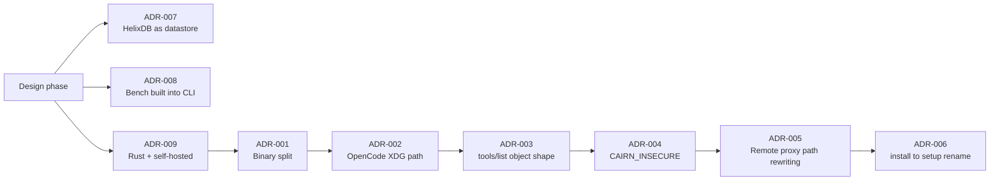

# Architecture Decision Records

Key decisions made during Cairn's development, with rationale. Ordered by recency.



---

## ADR-001: Binary split — `cairn` server + `cairn-cli` client

**Date:** 2026-06-18  
**Status:** Accepted

### Context
The original design called for a single `cairn` binary that handled both server operations
(`serve`, `token`, `pair-code`) and client operations (`mcp`, `setup`, `run`, `hook`, `sync`).
This created confusion: agents needed to install one binary but only use a subset of commands,
and the binary name collision made MCP config awkward (`command: ["cairn", "mcp"]` vs
`command: ["cairn-cli", "mcp"]`).

### Decision
Split into two binaries:
- **`cairn`** (crate `cairn-server`): server-only — `serve`, `token create/list/revoke`, `pair-code`.
- **`cairn-cli`** (crate `cairn-cli`): client-only — `mcp`, `setup`, `rules`, `run`, `hook`,
  `remember`, `recall`, `sync`, `pair`, `bench`, `update`, `doctor`.

### Rationale
- Clear separation of concerns: server runs once on a host, client runs on every device.
- MCP config is unambiguous: `command: ["cairn-cli", "mcp"]`.
- Smaller client binary (no server deps like axum-server).
- `cairn-cli update` updates only the client; server stays stable.

---

## ADR-002: OpenCode config path is XDG-style, not APPDATA

**Date:** 2026-06-18  
**Status:** Accepted

### Context
`cairn-cli setup opencode` initially wrote to `%APPDATA%\OpenCode\opencode.json` on Windows,
following the Windows convention. However, OpenCode on all platforms (including Windows) uses
`~/.config/opencode/opencode.json` (XDG-style). The setup was writing to the wrong path and
OpenCode never saw the cairn MCP entry.

### Decision
`opencode_config_path()` uses `XDG_CONFIG_HOME` or `USERPROFILE/.config/opencode/opencode.json`
on all platforms.

### Rationale
- OpenCode's `debug paths` confirmed `config: C:\Users\andre\.config\opencode`.
- Matching the actual path is the only way the setup works.

---

## ADR-003: MCP `tools/list` must return `{"tools": [...]}`, not a bare array

**Date:** 2026-06-18  
**Status:** Accepted

### Context
The `/api/tools/list` HTTP endpoint and the `RemoteProxy` initially returned a bare JSON array
of tool definitions. OpenCode's MCP client rejected this with "Failed to get tools" because the
MCP spec requires the result to be an object with a `tools` key.

### Decision
Both the HTTP endpoint and the proxy return `{"tools": [...]}`.

### Rationale
- MCP spec compliance.
- OpenCode (and other strict MCP clients) require the object shape.
- The local `McpServer` already did this correctly; only the HTTP/proxy path was wrong.

---

## ADR-004: `CAIRN_INSECURE=1` for local Docker HTTP dev

**Date:** 2026-06-18  
**Status:** Accepted

### Context
The server refuses to serve plain HTTP on non-loopback addresses (security default). Docker
Compose binds `0.0.0.0` inside the container (required for port mapping), so the server refused
to start without TLS. Generating self-signed certs added complexity for local dev.

### Decision
Added `CAIRN_INSECURE` env var. When `1`, the server allows plain HTTP on non-loopback with a
warning. Docker Compose sets it for local dev.

### Rationale
- Local Docker dev should be zero-config.
- Production users set up TLS (`CAIRN_TLS_CERT` + `CAIRN_TLS_KEY`) or a reverse proxy.
- The warning makes the tradeoff explicit in logs.

---

## ADR-005: Remote proxy path rewriting for file tools

**Date:** 2026-06-18  
**Status:** Accepted

### Context
In remote-proxy mode, `cairn-cli mcp` forwards all tool calls to the server. File tools (`read`,
`verify`, `checkpoint`, `rollback`) receive absolute host paths (e.g. `D:\code\Cairn\README.md`)
that don't exist inside the Docker container.

### Decision
1. Docker Compose mounts the host project read-only at `/workspace` with
   `CAIRN_WORKSPACE_ROOT=/workspace`.
2. `RemoteProxy` rewrites absolute host paths to workspace-relative before forwarding.

### Rationale
- File operations are inherently local — the files exist on the host, not the server.
- Mounting the project is the standard Docker dev pattern.
- Path rewriting is transparent to the agent — it sends normal paths, Cairn handles the rest.

---

## ADR-006: `install` renamed to `setup`

**Date:** 2026-06-18  
**Status:** Accepted

### Context
The original `cairn install <agent>` command was confusing because "install" implies installing
Cairn itself, not configuring an agent. It also didn't support `--server`/`--token` for remote
configuration.

### Decision
Renamed to `cairn-cli setup <agent>` with `--server` and `--token` flags. When `--server` is
provided, the MCP config includes `CAIRN_SERVER` and `CAIRN_TOKEN` env vars for remote-proxy mode.

### Rationale
- "setup" clearly means "wire up this agent to use Cairn".
- `--server`/`--token` enables one-command remote setup: `cairn-cli setup opencode --server http://... --token ...`.

---

## ADR-007: HelixDB as datastore (not SQLite/Postgres)

**Date:** Design phase  
**Status:** Accepted

### Context
Cairn needs both structured storage (memories, tokens, checkpoints, metadata) and vector search
(semantic recall). Options: SQLite + sqlite-vec, Postgres + pgvector, or a dedicated
graph+vector DB.

### Decision
Use **HelixDB** — a graph + vector database with HNSW indexing and S3 persistence.

### Rationale
- One backend for graph queries (memory relationships, file versions) and vectors (semantic recall).
- Bundled in `docker compose` (zero-config for local dev).
- S3 persistence via MinIO survives container restarts.
- The `StoreBackend` trait abstracts it, so swapping backends later is possible.

---

## ADR-008: `cairn-cli bench` built into the CLI

**Date:** Design phase  
**Status:** Accepted

### Context
Token savings claims need proof. External benchmark tools add friction; users won't install
them just to verify claims.

### Decision
`cairn-cli bench [path]` measures token savings on any codebase and prints a table.

### Rationale
- Zero-setup proof — the binary already has the read/compress logic.
- Users can verify claims on their own code immediately.
- Honest numbers (not cherry-picked marketing).

---

## ADR-009: Rust + self-hosted, no cloud dependencies

**Date:** Design phase  
**Status:** Accepted

### Context
The agent-memory market is crowded with cloud-hosted, Python/TS libraries. Cairn's audience is
self-hosters who want control and privacy.

### Decision
Build in **Rust** as a single self-hostable binary. No cloud accounts, no telemetry, no external
API calls unless the user opts in (embedding provider).

### Rationale
- Privacy by default — nothing leaves the user's infrastructure.
- Single binary deployment (runs on a Raspberry Pi).
- Rust's performance + safety for a reliability-critical tool.
- Differentiates from cloud-locked competitors.

---

## ADR-010: Durable audit log in HelixDB (not in-memory ring)

**Date:** 2026-06-20 (v0.5.0 Sprint 1)  
**Status:** Accepted

### Context
The pre-0.5.0 audit log was an in-memory ring buffer. Events vanished on restart, SSE replay
(`Last-Event-ID`) was unreliable, and the dashboard had to poll `/api/events` every 5 s.

### Decision
Persist audit events to **HelixDB** via an `AuditBackend` trait. The default impl is a
no-op (so offline tests don't need a backend); `HelixBackend` appends events as durable nodes
with monotonic integer ids. SSE replays from `max_event_id` and `recent_audit(since_id)`.

### Rationale
- Survives restarts — `audit_survives_round_trip_after_a_store_drop_and_reopen` test verifies.
- `Last-Event-ID` becomes reliable for UI reconnect without server-side state.
- NoSQL append-only schema is exactly what HelixDB is good at; no migration pain.
- Trait keeps the abstraction clean — a future Postgres backend can re-implement without
  touching the audit producer.

### Trade-offs
- One extra HelixDB write per audit event (~1-2 ms). Acceptable; audit is not on the hot path.
- Append-only schema means we can't physically delete rows; `get_meta_live` filters tombstone
  sentinels (`__deleted__`) instead.

---

## ADR-011: Memory `confidence` + `pinned` + provenance edges

**Date:** 2026-06-20 (v0.5.0 Sprint 2–3)  
**Status:** Accepted

### Context
Agentmemory's "reinforcement" curve (each access slightly raises confidence, asymptotic to 1.0)
is the right signal for "which memories should re-surface today?" — but pre-0.5.0 Cairn had no
confidence field, so recall used only lexical similarity. The memory graph (provenance: derived
from / contradicts / supersedes / applies_to) was also missing, so there was no way to express
"this crystallizes these three earlier notes."

### Decision
Add three things to `Memory`:
- `confidence: f32` (default 0.5) — bumped by the agentmemory formula
  `c' = min(1.0, c + 0.1*(1-c))` on every `reinforce()`.
- `pinned: bool` — never demoted by crystallize / decay passes; user-controlled.
- `derived_from`, `contradicts`, `supersedes`, `applies_to` — four `Vec<String>` columns of
  memory ids (or paths for `applies_to`).

Edges are stored as JSON-encoded columns on the `Memory` node, not as separate HelixDB graph
edges. The `MemoryEngine::graph()` method materializes a node+edge view from flat rows.

### Rationale
- Confidence gives recall a second axis to rank on (alongside lexical + applies_to).
- Pinned lets users mark "always show this" without writing a custom rule.
- Provenance edges enable `crystallize()` to derive a semantic-tier memory from working-tier
  inputs — the agentmemory "lesson" pattern.
- Storing edges as columns avoids HelixDB edge migrations when the edge schema evolves.

### Trade-offs
- `Memory` struct grew by 5 fields; tests that construct `Memory` literals need updating (caught
  by clippy in `extra.rs::graph_related_finds_memories_pointing_at_a_path`).
- `crystallize()` runs a single linear scan + one insert; fine up to ~10k memories, would need
  indexing past that.

---

## ADR-012: Sessions are on-disk JSONL, not HelixDB

**Date:** 2026-06-20 (v0.5.0 Sprint 4)  
**Status:** Accepted

### Context
"Sessions" track the per-task workflow: task list, drift events, approve/reject decisions. This
is operational metadata, not a queryable graph — there's no cross-session join, no vector
recall, no graph traversal needed.

### Decision
Store sessions as **JSON files under `<data_dir>/sessions/<id>.json`** and drift events as
**JSONL append-log under `<data_dir>/sessions/<id>.drift.jsonl`**. The new `cairn-session`
crate owns the read/write helpers and the patch schema.

### Rationale
- Append-only drift log mirrors the audit-log pattern (durability + replay), no migration.
- Single-file sessions are easy to back up, grep, and ship to support.
- Skipping HelixDB for operational metadata keeps the graph store focused on memories.

### Trade-offs
- No cross-session queries from the web UI yet (would need a separate index — Sprint 17 plans).
- Concurrent writers need an OS-level lock; we use `fs2` crate's `FileExt::lock_exclusive`.

---

## ADR-013: HMAC-SHA256 ledger for `context/assemble` runs

**Date:** 2026-06-20 (v0.5.0 Sprint 5)  
**Status:** Accepted

### Context
The savings dashboard needs a verifiable record of every context assembly: what was queried,
what was dropped, what was returned, how many tokens saved. Without signing, a malicious
extension could forge entries to inflate the savings number (or hide wasted context).

### Decision
Append-only ledger at `<data_dir>/ledger.jsonl` where each entry is:
```
{
  "ts": <unix_seconds>,
  "actor": "user|agent_name",
  "query_hash": "sha256:...",
  "budget": <int>,
  "drops": [<reason>...],
  "savings": { "tokens_in": N, "tokens_out": M, "saved_ratio": 0.0..1.0 },
  "mac": "hex(hmac_sha256(secret, canonical_json(entry_minus_mac)))"
}
```
Verification: recompute the canonical JSON, recompute the HMAC, compare. `cairn-cli assemble`
also exposes `/api/ledger/verify` for the dashboard's "verify chain" button.

### Rationale
- HMAC-SHA256 is symmetric: fast, deterministic, no key infrastructure. The same
  `CAIRN_SECRET_KEY` already gates JWT device tokens.
- Canonical JSON (BTreeMap key-sorted, hand-rolled escape) avoids canonicalisation drift.
- Append-only JSONL is grep-friendly and easy to ship to S3 for long-term audit.

### Trade-offs
- A leaked `CAIRN_SECRET_KEY` can forge ledger entries (but can also forge everything else —
  the threat model already assumes the secret is the root of trust).
- No entry deletion; revocation = an explicit "voided" marker (Sprint 13 follow-up).

---

## ADR-014: `.cairnpkg` format adopted from lean-ctx `.ctxpkg`

**Date:** 2026-06-20 (v0.5.0 Sprint 11)  
**Status:** Accepted

### Context
Cairn needs a portable bundle format to ship context (memories, profile, patterns, edges)
between machines — and ideally to interoperate with the wider lean-ctx ecosystem.

### Decision
Adopt the lean-ctx `.ctxpkg` design with three changes:
1. Canonical extension is `.cairnpkg` (not `.ctxpkg`); `.ctxpkg` is accepted as an import
   alias for interop per plan §10.
2. Layout is fixed: `manifest.json` + `memory.jsonl` + `profile.jsonl` + `patterns.jsonl` +
   `graph.jsonl` + `signature.sha256`. No pax extensions, no symlinks.
3. SHA-256 per-file in the manifest; `signature.sha256` is HMAC-SHA256 over the canonical
   manifest bytes.

Hand-rolled ustar writer/parser (no `tar` crate dependency) keeps the binary lean and the
parsing code small (~200 lines).

### Rationale
- A fixed, minimal layout means every Cairn release can read every older `.cairnpkg`.
- lean-ctx interop lets the same bundle round-trip in either tool; useful for cross-team sharing.
- Per-file SHA-256 catches bit-rot and partial downloads; the HMAC signature catches wholesale
  substitution attacks.

### Trade-offs
- No compression in the tarball itself (matches `.ctxpkg`); the `MAX_UNCOMPRESSED_BYTES = 16 MiB`
  cap rejects pathological packs. A future "packed" variant can add zstd without breaking the
  existing format.
- No per-entry permissions, owners, or symlinks — we don't need them.

---

## ADR-015: Cairn → hosted deploys via platform-native manifests

**Date:** 2026-06-20 (v0.5.0 Sprint 12)  
**Status:** Accepted

### Context
The Docker compose stack is the canonical local-dev path. For one-click hosted deploys we
needed Fly.io, Railway, and Render configs — but each platform has a different manifest
format and a different way to mount persistent disks.

### Decision
Ship three platform-native templates under `deploy/`:
- `fly.toml` — Fly's app config: machine size, persistent volume, http_checks on `/api/health`,
  TCP+TLS handlers.
- `railway.toml` — Railway's builder + deploy config with healthcheck + volume mount.
- `render.yaml` — Render's blueprint with a `cairn` web service + a dev-only `cairn-helix`
  worker (production should point `CAIRN_HELIX_URL` at a managed HelixDB).

All three are opinionated: bind to `0.0.0.0`, set `CAIRN_INSECURE=1` (TLS terminates at the
platform edge), and pin the image tag (`ghcr.io/vellixia/cairn:0.5.0`).

### Rationale
- Native manifests give each platform's tooling the metadata it needs (volume mounts,
  healthchecks, replica counts) without us maintaining a parallel deploy CLI.
- Dev-only `cairn-helix` worker on Render makes `Import Blueprint` succeed with zero config;
  the README warns that it's not for production.

### Trade-offs
- Pinning the image tag means a security patch requires editing three files + cutting a
  release. The release workflow updates them in lock-step.
- `CAIRN_INSECURE=1` is acceptable inside Fly/Railway/Render (TLS at the edge) but is **not**
  documented for self-hosted LAN use — that path still requires `CAIRN_TLS_CERT` +
  `CAIRN_TLS_KEY` (see ADR-004).

---

## ADR-016: Non-root Docker volume init (proper `cairn-init`)

**Date:** 2026-06-20 (v0.5.0 Sprint 12)  
**Status:** Accepted

### Context
The Docker image runs as the `cairn` user (uid 10001) but anonymous Docker volumes come up
owned by root. The pre-0.5.0 workaround was `user: "0"` on the cairn service, which meant the
server process ran with full root inside the container — an unnecessary privilege escalation
just to write a directory.

### Decision
Add a one-shot `cairn-init` service (alpine + `chown -R 10001:10001 /data`) that runs as root,
completes, then exits. The `cairn` service depends on `cairn-init: service_completed_successfully`
and runs as `user: "10001:10001"`.

### Rationale
- Init containers are the standard pattern for permission bootstrapping in compose / k8s.
- `restart: "no"` so a chown failure doesn't loop; the cairn service's own startup error
  surfaces the misconfiguration.
- Verifies with `stat -c %u /data` so a host-bind mount (which overrides the chown) fails
  fast with a useful message.

### Trade-offs
- One extra ~150 ms at first boot; negligible compared to the savings dashboard warm-up.
- A host-bind (`-v /host/path:/data`) still requires the host directory to be writable by
  uid 10001; the init container detects and fails fast.

---

## See also

- [Architecture](ARCHITECTURE.md) — how these decisions manifest in the code
- [Roadmap](ROADMAP.md) — what's done, what's next
- [Web](WEB.md) — admin/CLI auth split surface
- [Upgrading](UPGRADING.md) — 0.3.x → 0.4.0 migration
- [Audit Report](audits/REPORT.md) — security findings that informed several of these decisions