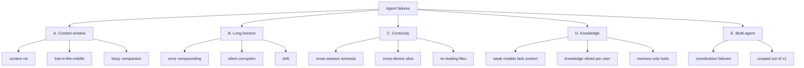
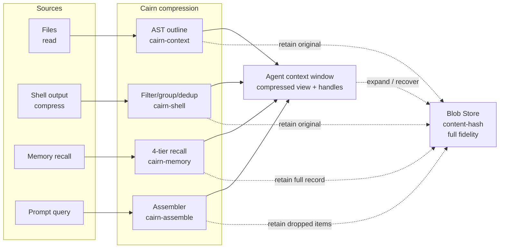

# Cairn — The Open-Source Context & Reliability Layer for AI Agents

> **Make any model smart.** Remember everything · feed less, not more · stay reliable on long
> tasks · get smarter together — self-hosted, one Rust binary, with no context ever lost.

---

## Context

Using AI coding agents (Claude Code, Codex, OpenCode, Cursor…) over long or multi-session work
fails in ways that bigger context windows do **not** fix. The user named two pains (forgetting,
re-reading); 2026 research shows the problem is deeper and partly *architectural*. Cairn is a
new, from-scratch **Rust** tool that unifies the best ideas of four references into one
self-hostable engine, and addresses **all** of the failure classes below.

### The four references (ideas only — no forking)

| Project | Lang | What we take |
|---|---|---|
| **agentmemory** (rohitg00) | TS/iii | 4-tier memory (working→episodic→semantic→procedural), consolidation/decay, hybrid recall (BM25+vector+graph, RRF), lifecycle hooks, viewer |
| **lean-ctx** (yvgude) | Rust | 10 read modes, ~13-tok cached re-reads, tree-sitter AST (11 langs), property graph, `serve` HTTP-MCP |
| **rtk / Rust Token Killer** (rtk-ai) | Rust | Command-output compression (filter/group/dedup) via hooks, 100+ filters, **tee/recover**, single binary, ~80% session cut — proves the Rust+hook approach |
| **caveman** (JuliusBrussee) | JS/Py | Output-**style** compression (~65% output cut, reasoning intact); finding that brevity can *raise* accuracy |

**Name:** **Cairn** — a stack of trail-marker stones. Travelers each add a stone, everyone who
follows benefits (**collective knowledge**); each session leaves a marker the next one follows
(**memory**); a cairn is minimal — only the stones needed to navigate (**lean, no-loss context**).

---

## Decisions locked (from Q&A)

- **Build:** brand-new tool in **Rust**; all four projects are references only.
- **Audience:** **open-source, self-hosted** — public repo, many self-hosters, **federation**
  between servers, **high polish + a high privacy/sanitization bar.**
- **Posture:** **active guardrails** — Cairn doesn't just feed context, it *verifies* agent
  output against retained originals, detects drift, and re-anchors long tasks. (Not full
  multi-agent orchestration in v1 — see Scope.)
- **Hero:** *all of it* — five pillars, unified. Umbrella message: "the context & reliability
  layer." Punch line: "make any model smart."
- **Name:** Cairn (backups: Mnemo, Marrow).

---

## Deep Problem Analysis (2026 research)

**The throughline: the bottleneck is the *context fed to the model* and the *drift over time* —
not the model's IQ.** That is exactly the gap Cairn fills, and why "make a dumb model smart" is
achievable. Failures group into five classes:

**A. Context-window failures (architectural — bigger windows don't help):**
- **Context rot** — Chroma tested 18 frontier models; *all* degrade as input grows, even on
  trivial tasks; quality "drops off a cliff" past ~50% fill. Cause is attention math (RoPE decay
  + softmax), not retrieval. → *feed less + ordered, don't just compress.*
- **Lost-in-the-middle** — mid-context info is ignored; models favor the edges. → *put critical
  facts at the start/end.*
- **Lossy compaction** — auto-summarization silently drops decisions, constraints, gotchas.

**B. Long-horizon failures (temporal — the active-guardrails target):**
- **Error compounding / reasoning drift** — small per-step errors snowball to systematic
  failure; silent, "no stack trace, no alert" (Microsoft: models "can't handle long-running tasks").
- **Silent corruption when delegating** — frontier models lost ~25% of document content over 20
  delegated edits. → *verify output against a retained ground truth.*
- **Reliability ≠ pass@1** — production needs reliability across many steps.

**C. Continuity failures (state):** cross-session amnesia · cross-device silos · cross-agent
silos · re-reading unchanged files · re-explaining conventions · lost rationale · no task resume.

**D. Knowledge/capability failures (collective):** weak/cheap models underperform for lack of
context (not IQ) · knowledge siloed per user · everyone re-learns the same lessons · the agent-
memory market is hot but **memory-only** (MemPalace, mem0…) — no unified, self-host, no-loss,
reliable, collective solution.

**E. Multi-agent (scoped out of v1):** 41–86% failure rates, mostly *coordination*, not
capability; "context collapse" is the top long-task killer; single-agent often *beats*
multi-agent. → Cairn targets **single-agent reliability first**; shared-context primitives later.

---

## Core Principles

1. **No context loss — lossless by retention.** Cairn is a stateful server: every compression
   (file, shell output, response, memory) **retains the full-fidelity original** in a content-
   hash blob store. The agent gets a **compressed view + a handle**; any view is **expandable on
   demand** (`expand`/`recover`). Window shrinks 60–90%; the system loses nothing. (Beats rtk's
   stateless re-exec and caveman's irreversible loss.)
2. **Less, not more — anti-rot.** Don't dump context. **Assemble** the minimal, highest-signal,
   best-*ordered* working set under a token budget; critical facts at the edges; the rest one
   `expand` away.
3. **Private by default.** Nothing leaves a device/server without explicit, sanitized, revocable
   opt-in. Essential for an open-source, federated, collective product.

---

## Product Vision — five pillars

```mermaid
graph TD
    Root["Cairn — 5 pillars"]

    Remember["Remember"]
    Compress["Compress"]
    Assemble["Assemble"]
    Reliable["Reliable"]
    Smarter["Smarter together"]

    Root --> Remember
    Root --> Compress
    Root --> Assemble
    Root --> Reliable
    Root --> Smarter

    Remember --> R1["cross-session memory"]
    Remember --> R2["cross-device sync"]
    Remember --> R3["decisions + rationale"]

    Compress --> C1["file reads — AST"]
    Compress --> C2["shell output"]
    Compress --> C3["lossless via expand"]

    Assemble --> A1["token-budgeted"]
    Assemble --> A2["edge-ordered"]
    Assemble --> A3["anti-context-rot"]

    Reliable --> Re1["verify vs originals"]
    Reliable --> Re2["drift detection"]
    Reliable --> Re3["checkpoint / rollback"]

    Smarter --> S1["preference learning"]
    Smarter --> S2["collective knowledge"]
    Smarter --> S3["opt-in federation"]
```

1. **Remember** — never start cold; decisions/tasks/rationale persist across sessions, devices, agents.
2. **Compress without loss** — files, shell output, responses shrink in the window, stay fully recoverable.
3. **Assemble lean context** — fight context rot: feed less, higher-signal, well-ordered context.
4. **Stay reliable** — verify edits vs originals, detect drift, re-anchor long tasks (active guardrails).
5. **Get smarter together** — learn each user's preferences + opt-in **collective knowledge** so
   cheap/small models behave like senior, personalized engineers.

**Differentiation / moat:** most agent-memory tools are memory-only, cloud/library, Python.
Cairn unifies **memory + no-loss compression + anti-rot assembly + active reliability + collective
federation** as one self-hostable **Rust** binary. The *integration* is the moat.

---

## Branding

- **Name:** Cairn. **Hero:** *"Make any model smart."* **Umbrella:** *"The open-source context &
  reliability layer for AI agents."*
- **Logo:** minimal 3-stone stack doubling as graph nodes; top stone = accent ("trail blaze").
- **Palette:** Ink `#0B0F14` · Surface `#12181F` · Slate `#8A94A6` · Off-white `#ECEFF4` · Accent
  ember `#FB923C` · Signal teal `#2DD4BF`.
- **Type:** Geist Sans + Geist Mono (Inter + JetBrains Mono fallback).
- **Voice:** precise, calm, wayfinding — "leave a marker," "only the stones you need," "never
  start cold," "every traveler adds a stone."

---

## Compression/assembly layers (all recoverable)

| Layer | Reference | Crate | Recover via |
|---|---|---|---|
| File reads | lean-ctx modes + cache | `cairn-context` | `expand` (blob store) |
| Shell/tool output | rtk filter/group/dedup | `cairn-shell` | `recover` (tee→blob store) |
| Model responses | caveman style (opt-in) | `cairn-context` | original retained |
| Memory recall | agentmemory tiers + RRF | `cairn-memory` | full record on expand |
| Working set | Context Assembler | `cairn-context` | `expand` any dropped item |

---

## Privacy & sanitization (mandatory for OSS + collective + federation)

- **Default private.** Nothing is shared/federated without explicit opt-in.
- **Sanitization pipeline** before any publish/federate: secret detection + strip (keys, tokens,
  `.env`), PII redaction, path/identifier anonymization, optional manual review with **diff
  preview**, consent gate.
- **Provenance + signing:** shared knowledge packs are signed; recall shows source + trust.
- **Revocation:** `unshare` removes from the pool and propagates revocation to subscribers (best-effort).
- **E2E option** for personal multi-device sync; **no telemetry** by default (opt-in anon stats, like rtk).
- **Federation:** servers subscribe to curated, signed packs under trust/scope/rate policies.
- Ship a **SECURITY.md + threat model** focused on the collective/federation surface.

---

## Web Control Plane (operational UI) — you *do* things here, not just watch

One web app (also serves the landing site) = the single pane of glass to **install, connect,
configure, inspect, edit, approve, share, and debug**. Real-time (WS), keyboard-first (**⌘K
command palette** to search memory/code/sessions/collective and run actions), dark brand theme,
**responsive** (check status + approve flags from your phone).

- **Setup wizard (first run):** create account → pick embedding provider → **Add Device**
  (copy-paste installer + QR/pairing code) → **Connect Agents** (one-click per detected agent) →
  green health check.
- **Devices & Agents (install hub):** every device + which agents are configured on each, live
  connection status, **generate install command / pairing code / QR**, mint/revoke tokens, remove a device.
- **Memory workspace (editable):** search; **create / edit / pin / delete** memories; mark
  important; resolve contradictions; view+edit rationale; promote working→semantic; bulk actions.
- **Profile editor:** view / approve / edit learned preferences + do/don't rules.
- **Assembler playground (inspector):** type a query + token budget → see exactly what context
  Cairn would feed, what it drops and **why**, the token count; `expand` any item.
- **Reliability center:** review drift events, verification flags; **approve / reject** flagged
  edits; **roll back to a checkpoint**; set/adjust the task anchor.
- **Collective / Federation manager:** browse/search the pool; **publish** with sanitization
  **diff preview** + consent; **pull** packs; subscribe to federated servers.
- **Savings & recover:** tokens/$ saved, signed savings ledger, and **expand/recover any
  compressed artifact** — for trust + debugging.
- **Sessions:** live stream + replay; jump from a session to its memories/decisions; **Resume
  task** (re-inject the anchor + assembled context into a fresh session on any device).
- **Settings:** embedding provider + keys, budgets/SLOs, roles, privacy/sanitization rules, auth,
  backup / export / import.

---

## Install & Onboarding (dead-simple — the user's priority)

**Goal:** install on any device in **one command**, and connect every agent automatically. A
single static Rust binary — **no Node/Python/runtime** to install.

**1. Server (once — home server / NAS / Pi / VPS):**
- One-liner: `curl -fsSL https://cairn.sh/install.sh | sh` · Windows: `irm https://cairn.sh/install.ps1 | iex`.
- Or Docker: `docker compose up -d`.
- Or one-click: Fly / Railway / Render deploy buttons.
- `cairn serve` starts the server **+ embedded web UI**, and prints the URL + a first-run admin link.

**2. Each device (the "easy on every device" part) — Tailscale / `gh`-style pairing:**
- In the web UI, click **Add Device** → it shows a copy-paste one-liner with a short-lived
  pairing code (and a **QR code** for mobile).
- That command **installs the binary, pairs the device** to your server (device-code flow — no
  manual token juggling), then runs **`cairn-cli setup --all`** to **auto-detect installed agents**
  (Claude Code, Codex, OpenCode, Cursor, Windsurf, Cline, Gemini CLI, Copilot…) and write their
  **hook + MCP config** to point at your server.
- Manual paths exist too: `cairn-cli pair <code>`, `cairn-cli setup <agent>`, `cairn-cli doctor`.

**3. Connectivity (self-host reality):** default LAN; for remote devices, recommend
  **Tailscale/VPN** (zero-config, private) or an optional TLS reverse proxy. The web UI detects
  the situation and shows the right URL/QR per device.

**4. Updates:** `cairn-cli update` self-updates the binary; the server flags when an update is available.

---

## Open-source & community

- **License:** **Apache-2.0** for the core (permissive, max adoption, matches rtk).
- **Repo:** monorepo — Cargo workspace + `/web` (Next.js) + `/docs`.
- **Install:** one-command shell installer + cargo + prebuilt binaries (musl, mac
  arm/x86, windows); `cairn-cli setup <agent>` auto-configs agents (hooks + MCP).
- **Project files:** README, CONTRIBUTING, SECURITY.md + threat model, governance, Discord/community.
- **CI:** `cargo test`/`clippy`/`fmt`, web build, docker build, multi-platform release, **benchmark CI**.

---

## Scope & risks

- **Scope discipline:** multi-month product. Parallel tracks, but each ships a **thin** slice
  before depth. **Multi-agent orchestration is out of v1** (single-agent reliability first — the
  research shows single-agent often wins and coordination is where multi-agent fails).
- **Privacy of collective/federation is the #1 risk** — sanitization + consent + provenance +
  revocation must be airtight before any public pool/federation ships. Everything defaults private.
- **Lossy response-style compression (caveman) stays opt-in** and never touches stored fidelity.
- **Rust maturity:** confirm `rmcp` + `fastembed`; `automerge` sync + federation are the most
  novel pieces — prototype early (Phase 2/3).
- **Crowded memory market:** differentiate via the *integration* (memory + no-loss + assembly +
  guardrails + federation) and publish honest benchmarks; don't claim numbers until measured.
- **Naming/domain:** finalize Cairn vs. backups and secure a domain + the GitHub org before launch copy.

---

## See also

- [Architecture](ARCHITECTURE.md) — how the code is structured today (crate graph, data flow, tool surface)
- [Roadmap](ROADMAP.md) — what's done, what's in progress, what's next
- [Benchmarks](BENCHMARKS.md) — methodology + measured numbers + targets
- [Audit Report](audits/REPORT.md) — security audit with fix-status tracking