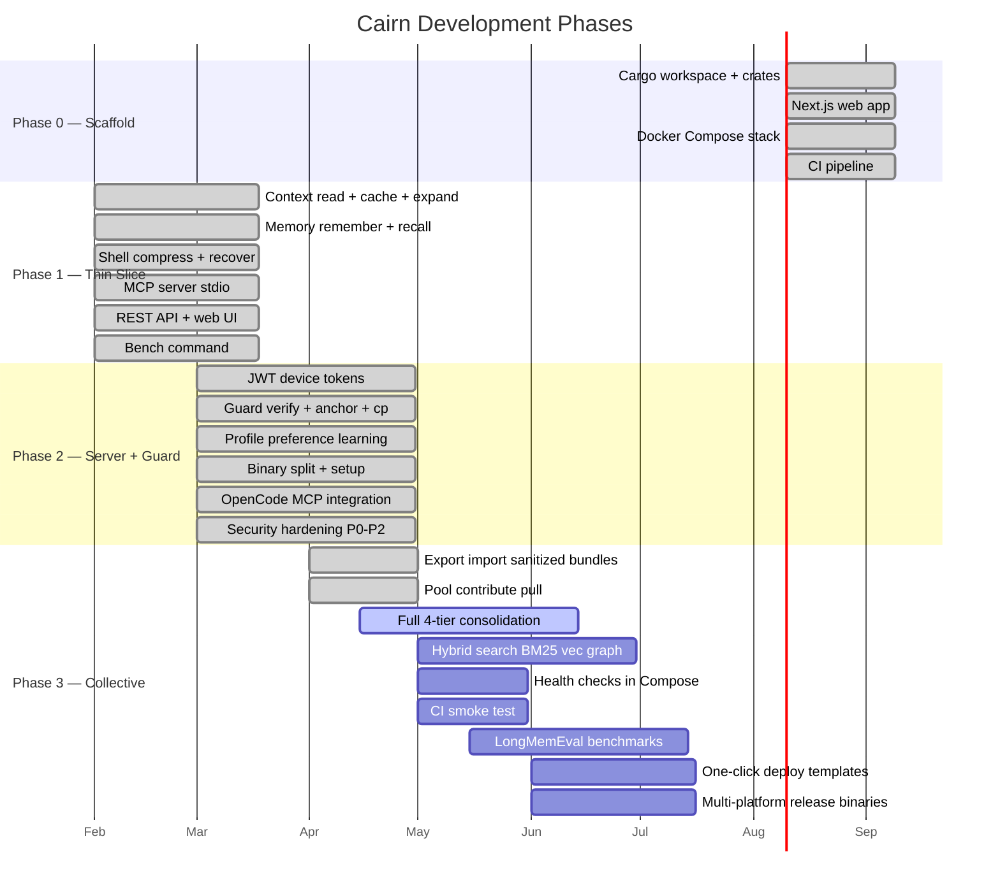

# Roadmap

Status tracker for Cairn development. Mapped to the phases defined in [PLAN.md](PLAN.md).

---

## Phase 0 — Scaffold

| Item | Status | Notes |
|---|---|---|
| Cargo workspace + crate structure | Done | 14 crates |
| Next.js web app (landing + dashboard) | Done | Static export, embedded via rust-embed |
| Docker Compose stack (Cairn + HelixDB + MinIO) | Done | `docker compose up -d` |
| CI pipeline (test/clippy/fmt) | Done | GitHub Actions |
| Brand identity (name/logo/palette) | Done | Cairn — 3-stone cairn, ember accent |

---

## Phase 1 — Thin Vertical Slice

| Item | Status | Notes |
|---|---|---|
| `cairn-context`: read modes + cache + expand | Done | 4 modes (auto/full/signatures/map), ~13-tok re-reads |
| `cairn-context`: tree-sitter AST outlines | Done | 11 languages (Rust, Python, JS, TS, Go, C, C++, Java, C#, Ruby, Bash) |
| `cairn-shell`: compress + recover | Done | RTK-style filter/group/dedup, lossless via blob store |
| `cairn-memory`: remember/recall/wakeup | Done | 4-tier, BM25 lexical recall, Ebbinghaus decay |
| `cairn-assemble`: token-budgeted context assembly | Done | Edge-ordered, reports dropped items |
| `cairn-mcp`: MCP server over stdio | Done | 16 tools, local + remote proxy modes |
| `cairn-api`: REST API | Done | 27 endpoints, embedded web UI |
| `cairn-cli`: `bench` command | Done | Measures token savings on a codebase |
| Web UI: landing page | Done | Next.js static export |
| Web UI: dashboard shell | Done | Overview, memory, context views |

---

## Phase 2 — Server, Sync, Smart + Guard

| Item | Status | Notes |
|---|---|---|
| Signed device tokens (JWT + HMAC) | Done | HS256, `CAIRN_SECRET_KEY` |
| Token scopes (admin/write/read) | Done | Parsed from JWT claims |
| Token expiration | Done | Optional `--expires` days |
| `cairn-guard`: verify vs original | Done | Content-hash diff, flags large deletions |
| `cairn-guard`: task anchor | Done | Set/read, re-injected at session start |
| `cairn-guard`: checkpoint/rollback | Done | Snapshot tracked files, restore on demand |
| `cairn-guard`: reliability score | Done | Per-session, reflects recent outcomes |
| `cairn-profile`: preference learning | Done | `prefer`/`profile` tools, injected at session start |
| `cairn-share`: sanitization | Done | Secret/PII redaction, classification, diff preview |
| Multi-device sync (pull/push) | Done | Last-write-wins on `updated_at` |
| Pairing codes (device-code flow) | Done | Short, single-use, rate-limited |
| Binary split (`cairn` server + `cairn-cli` client) | Done | Two binaries, clear separation |
| `cairn-cli setup <agent>` | Done | Claude Code, Cursor, VS Code, Windsurf, OpenCode |
| `cairn-cli setup --all` (auto-detect) | Done | Detects from project/home markers |
| Lifecycle hooks (Claude Code) | Done | SessionStart/UserPromptSubmit/PostToolUse/SessionEnd |
| Remote proxy MCP mode | Done | `CAIRN_SERVER` + `CAIRN_TOKEN`, no local HelixDB |
| Path rewriting for remote file tools | Done | Host → workspace-relative, mounted at `/workspace` |
| OpenCode MCP integration | Done | Config at `~/.config/opencode/opencode.json`, verified end-to-end |
| TLS gate | Done | Refuses HTTP on non-loopback unless `CAIRN_INSECURE=1` or TLS set |
| `CAIRN_INSECURE` escape hatch | Done | For local Docker dev with plain HTTP |
| Workspace root boundary | Done | `CAIRN_WORKSPACE_ROOT`, path traversal rejected |
| Install script checksums | Done | SHA256SUMS verification |
| MinIO credential guard | Done | Refuses insecure defaults |
| CORS allow-list | Done | `CAIRN_CORS_ORIGINS`, default same-origin |
| Rate limiting | Done | 60/min API, 5/min pairing |
| Dependency pinning (tilde) | Done | `~major.minor`, `cargo build --locked` |
| `cargo audit` + `cargo deny` in CI | Done | Blocks on advisories/duplicates |
| SLSA + Sigstore signing | Done | Release binaries signed |
| Pinned GitHub Actions (SHA) | Done | Supply-chain hardening |

---

## Phase 3 — Collective + Federation + Depth (next)

| Item | Status | Notes |
|---|---|---|
| `cairn-share`: export/import sanitized bundles | Done | Redacts PII, withholds hard secrets |
| `cairn-share`: pool contribute/pull | Done | Federated sanitized knowledge |
| Full 4-tier consolidation/decay | Partial | Consolidation implemented, decay tuning ongoing |
| Property graph + impact analysis | Not started | Planned as `cairn-graph` or in `cairn-context` |
| Hybrid search (BM25 + vector + graph, RRF) | Partial | BM25 done, HNSW vectors via HelixDB, graph not yet |
| Rerank + MMR diversity | Not started | Post-retrieval quality improvements |
| Offline-first sync (automerge CRDT) | Not started | Currently last-write-wins |
| E2E encryption for sync | Not started | Optional, for privacy-sensitive setups |
| Federation (signed packs, trust/scopes) | Partial | Share/pool exists, full federation protocol TBD |
| Collective voting/provenance/decay | Not started | Community governance for shared knowledge |
| Health checks in Docker Compose | Not started | Currently `depends_on` only waits for start |
| Non-root Docker volume init | Not started | Currently `user: "0"` workaround |
| CI smoke test (compose + API) | Not started | Prevent regressions like bare-array tools/list bug |
| LongMemEval / LoCoMo benchmarks | Not started | Standard recall benchmarks |
| Task-success lift at increasing horizons | Not started | Drift/reliability benchmark |
| Full README update (two-binary flow) | Partial | Updated but needs OpenCode quickstart section |
| One-click deploy (Fly/Railway/Render) | Not started | Deploy templates |
| Multi-platform release binaries | Not started | musl, mac arm/x86, windows |
| Homebrew tap | Not started | `brew install cairn` |

---

## Verification Milestones

| Milestone | Status |
|---|---|
| Fresh clone builds (`cargo check --workspace`) | Passed |
| `cargo test --workspace` (103+ tests) | Passed |
| `cargo clippy --workspace -- -D warnings` | Passed |
| `docker compose up -d` from clean checkout | Passed |
| `cairn-cli bench` shows 90%+ savings | Passed |
| OpenCode MCP: remember/recall/wakeup/sanitize | Passed (verified live) |
| OpenCode MCP: read (remote proxy with workspace mount) | Passed (verified live) |
| Multi-device: memory on one device recalled on another | Passed (via sync) |
| Edit verification: corrupted edit flagged | Passed (guard tests) |
| Checkpoint/rollback | Passed (guard tests) |

---

## See also

- [Plan](PLAN.md) — product vision and phases
- [Architecture](ARCHITECTURE.md) — how it works today
- [Decisions](DECISIONS.md) — why we chose what we chose
- [Benchmarks](BENCHMARKS.md) — measured numbers
- [Audit Report](audits/REPORT.md) — security findings with fix status