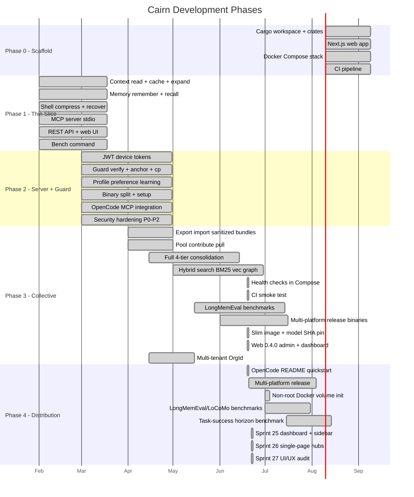

# Roadmap

Status tracker for Cairn development. Mapped to the phases defined in [Vision](../reference/vision.md).

---

## Phase 0 - Scaffold

| Item | Status | Notes |
|---|---|---|
| Cargo workspace + crate structure | Done | 21 crates (8 added in 0.5.0: session, pack, registry, sync, bench, proactive, proxy, ingest; cairn-server dropped in 0.6.0 - its bin now lives in cairn-api) |
| Next.js web app (admin console, sidebar dashboard) | Done | Static export, embedded via rust-embed; cairn-api/build.rs creates `web/out/` at compile time when missing |
| Docker Compose stack (Cairn + HelixDB + MinIO) | Done | `docker compose up -d` |
| CI pipeline (test/clippy/fmt) | Done | GitHub Actions |
| Brand identity (name/logo/palette) | Done | Cairn - 3-stone cairn, ember accent |

---

## Phase 1 - Thin Vertical Slice

| Item | Status | Notes |
|---|---|---|
| `cairn-context`: read modes + cache + expand | Done | 4 modes (auto/full/signatures/map), ~13-tok re-reads |
| `cairn-context`: tree-sitter AST outlines | Done | 11 languages (Rust, Python, JS, TS, Go, C, C++, Java, C#, Ruby, Bash) |
| `cairn-shell`: compress + recover | Done | RTK-style filter/group/dedup, lossless via blob store |
| `cairn-memory`: remember/recall/wakeup | Done | 4-tier, BM25 lexical recall, Ebbinghaus decay |
| `cairn-assemble`: token-budgeted context assembly | Done | Edge-ordered, reports dropped items |
| `cairn-mcp`: MCP server over stdio | Done | 29 tools + 10 graph actions = 39, local + remote proxy modes |
| `cairn-api`: REST API | Done | 27 endpoints, embedded web UI |
| `cairn`: `bench` command | Done | Measures token savings on a codebase |
| Web UI: landing page | Done | Next.js static export |
| Web UI: dashboard shell | Done | Overview, memory, context views |

---

## Phase 2 - Server, Sync, Smart + Guard

| Item | Status | Notes |
|---|---|---|
| Signed device tokens (JWT + HMAC) | Done | HS256, `CAIRN_SECRET_KEY` |
| Token scopes (admin/write/read) | Done | Parsed from JWT claims |
| Token expiration | Done | Optional `--expires` days |
| `cairn-guard`: verify vs original | Done | Content-hash diff, flags large deletions |
| `cairn-guard`: task anchor | Done | Set/read, re-injected at session start |
| `cairn-guard`: checkpoint/rollback | Done | Snapshot tracked files, restore on demand |
| `cairn-guard`: reliability score | Done | Per-session, reflects recent outcomes |
| `cairn-profile`: preference learning | Done | `prefer`/`profile` tools, injected at session start |
| `cairn-share`: sanitization | Done | Secret/PII redaction, classification, diff preview |
| Multi-device sync (pull/push) | Done | Last-write-wins on `updated_at` |
| Pairing codes (device-code flow) | Done | Short, single-use |
| Binary split (`cairn` server + `cairn` client) | Done | Two binaries, clear separation |
| `cairn setup <agent>` | Done | Claude Code, Codex CLI, OpenCode |
| `cairn setup --all` (auto-detect) | Done | Detects from project/home markers |
| Lifecycle hooks (Claude Code) | Done | SessionStart/UserPromptSubmit/PostToolUse/SessionEnd |
| Remote proxy MCP mode | Done | `CAIRN_SERVER` + `CAIRN_TOKEN`, no local HelixDB |
| Path rewriting for remote file tools | Done | Host -> workspace-relative, mounted at `/workspace` |
| OpenCode MCP integration | Done | Config at `~/.config/opencode/opencode.json`, verified end-to-end |
| TLS gate | Done | Refuses HTTP on non-loopback unless `CAIRN_INSECURE=1` or TLS set |
| `CAIRN_INSECURE` escape hatch | Done | For local Docker dev with plain HTTP |
| Workspace root boundary | Done | `CAIRN_WORKSPACE_ROOT`, path traversal rejected |
| Install script checksums | Done | SHA256SUMS verification |
| MinIO credential guard | Done | Refuses insecure defaults |
| CORS allow-list | Done | `CAIRN_CORS_ORIGINS`, default same-origin |
| Dependency pinning (tilde) | Done | `~major.minor`, `cargo build --locked` |
| `cargo audit` + `cargo deny` in CI | Done | Blocks on advisories/duplicates |
| SLSA + Sigstore signing | Done | Release binaries signed |
| Pinned GitHub Actions (SHA) | Done | Supply-chain hardening |

---

## Phase 3 - Collective + Federation + Depth

### Done

| Item | Status | Notes |
|---|---|---|
| `cairn-share`: export/import sanitized bundles | Done | Redacts PII, withholds hard secrets |
| `cairn-share`: pool contribute/pull | Done | Federated sanitized knowledge (admin-scoped token required) |
| Health checks in Docker Compose | Done | minio/helix/cairn all `service_healthy`; `depends_on: service_healthy`; minio-init bounded retry |
| CI smoke test (compose + API) | Done | `ci-smoke` job asserted `{"tools":[...]}` envelope + 5 tools. **Superseded** by the 54-test live suite (see `docs/testing/overview.md`); removed from CI. |
| Single admin account + cookie session (0.4.0) | Done | Argon2id hash, httpOnly HMAC-SHA256 cookie, sliding TTL, generation counter for instant invalidation |
| Admin recovery: `cairn-server admin password` + `reset` | Done | Loopback-only, mirrors the TLS gate; resets write a tombstone (HelixDB append-only schema) |
| Web: sidebar dashboard + login + setup wizard | Done | SessionGate probes `/api/auth/status` + `/me`; `aria-current` sidebar, K palette, toast system |
| Admin token issuance from the dashboard | Done | `/api/devices/{tokens, pair-codes, audit}` admin endpoints; CLI flow unchanged |
| Security headers middleware | Done | `X-Frame-Options: DENY`, `X-Content-Type-Options: nosniff`, `Referrer-Policy: no-referrer`, `Permissions-Policy: clipboard-write=(self)` |

### In progress / partial

| Item | Status | Notes |
|---|---|---|
| Full 4-tier consolidation/decay | Partial | Consolidation implemented, decay tuning ongoing |
| Hybrid search (BM25 + vector + graph, RRF) | Partial | BM25 done, HNSW vectors via HelixDB, **graph leg next** |
| Federation (signed packs, trust/scopes) | Partial | Share/pool exists, full federation protocol TBD |

### Backlog

| Item | Status | Notes |
|---|---|---|
| Property graph + impact analysis | Not started | Feeds the graph leg of hybrid search; planned as `cairn-graph` or in `cairn-context` |
| Rerank + MMR diversity | Not started | Post-retrieval quality improvements; high-leverage, small change |
| Offline-first sync (automerge CRDT) | Not started | Currently last-write-wins |
| E2E encryption for sync | Not started | Optional, for privacy-sensitive setups |
| Collective voting/provenance/decay | Not started | Community governance for shared knowledge |

### Hardening & DX (audit-driven)

| Item | Status | Notes |
|---|---|---|
| Slim default Docker image; `embed-local` opt-in | Done | Default `CAIRN_FEATURES=""`; opt back in with `--build-arg CAIRN_FEATURES=embed-local`. Closes audit M-12. |
| Local model SHA-256 verification | Done | `CAIRN_EMBED_FASTEMBED_SHA256` pin; constant-time compare; logs actual hash at WARN when no pin set. Closes audit M-9. |

---

## Phase 4 - Distribution

The product is feature-complete enough to install and use. The remaining work is **getting it onto every machine people use** - distribution channels, install paths, and the benchmarks that turn the engineering into marketing.

| Item | Status | Notes |
|---|---|---|
| OpenCode README quickstart | Done | New "OpenCode quickstart" section in README |
| Multi-platform release binaries | Not started | `x86_64-unknown-linux-musl`, `aarch64-unknown-linux-musl`, `x86_64-apple-darwin`, `aarch64-apple-darwin`, `x86_64-pc-windows-msvc`, `aarch64-pc-windows-msvc`; upload + `SHA256SUMS` per release |
| Non-root Docker volume init | Done | New `cairn-init` one-shot chowns `/data` to uid 10001, verifies with `stat`, fails fast on host-bind misconfig. cairn service runs as `user: "10001:10001"` - verified live (`uid=10001(cairn)`) |
| LongMemEval / LoCoMo benchmarks | Not started | Standard recall benchmarks; publish numbers in `docs/testing/benchmarks.md` |
| Task-success lift at increasing horizons | Not started | Synthetic drift benchmark; cite the architecture justification in `docs/reference/vision.md` |

---

## Verification Milestones

| Milestone | Status |
|---|---|
| Fresh clone builds (`cargo check --workspace`) | Passed |
| `cargo test --workspace` (330 tests, 5 ignored - v0.5.0) | Passed |
| `cargo clippy --workspace --all-targets -- -D warnings` | Passed |
| `docker compose up -d` from clean checkout (cairn runs as uid 10001, not root) | Passed (verified live in v0.5.0) |
| Docker compose health checks (all 3 services `healthy`) | Passed (verified live) |
| 20-scenario end-to-end live harness (memory/context/guard/profile/shell/assembly/sanitize/sync/share/api/setup/bench/path-rewrite) | Passed (verified live) - see `docs/testing/overview.md` + `docs/testing/e2e.md` |
| `cairn bench` shows 90%+ savings | Passed |
| OpenCode MCP: remember/recall/wakeup/sanitize | Passed (verified live) |
| OpenCode MCP: read (remote proxy with workspace mount) | Passed (verified live) |
| Multi-device: memory on one device recalled on another | Passed (via sync) |
| Edit verification: corrupted edit flagged | Passed (guard tests) |
| Checkpoint/rollback | Passed (guard tests) |
| First-run: no admin -> `/setup` wizard -> cookie set -> dashboard reachable | Passed |
| Admin login -> cookie session -> dashboard behind auth | Passed |
| Admin issues device token from Devices panel -> CLI sync succeeds | Passed |
| Cookie expires after TTL -> `/login` shown; existing cookie rejected | Passed |
| `cairn-server admin password` rotates + invalidates all sessions | Passed |
| `cairn-server admin reset` clears admin via tombstone; next `/setup` succeeds | Passed |
| Web: cairn-api/build.rs creates `web/out/` at compile time when missing; `cargo build` is hermetic (no Node required) | Passed |
| Phase 4.1 (Sprint 13) - cairn-registry + Ed25519 pack signing | Passed | `cb06f9f` |
| Phase 4.1 (Sprint 14) - Trust scopes + revocation cascade + provenance | Passed | `398a052` |
| Phase 4.1 (Sprint 15) - cairn-sync CRDTs + E2E encryption + threat model | Passed | `06f5b4e` |
| Phase 4.2 (Sprint 16) - cairn-bench + LongMemEval/horizon/retention | Passed | `455c34b` |
| Phase 4.2 (Sprint 17) - public landing page + comparison + cross-links | Passed | `45d1e39` |
| Phase 5 (Sprint 18) - cairn-proactive + intent-detection hook + opt-out | Passed | `fcc8487` |
| Phase 5 (Sprint 19a) - multi-tenant `OrgId` + tenant-scoped recall | Passed | `d69d3c4` |
| Phase 5 (Sprint 19b) - cairn-proxy (cairn.sh reverse proxy) | Passed | `9c60a7b` |
| Phase 5 (Sprint 20) - PWA service worker + push subscription store | Passed | `f484a44` |
| Phase 5 (Sprint 21) - `/api/extensions/capture` endpoint (loopback-only) | Passed | `06e6740` |
| Phase 5 (Sprint 22) - cairn-ingest VTT/SRT/JSON parsers + chunking | Passed | `ae68b06` |
| Phase 5 (Sprint 23) - mobile companion PWA scaffold + biometric gate | Passed | `06e6740` |
| **Sprint 25 - dashboard overview + sidebar refresh** - KPI hero, HealthRow, ActivityTimeline, SavingsChart (Recharts), DriftAnchorCard, recent memory; collapsible sidebar (8 groups, `localStorage` persisted) | Passed | branch `sprint/25-dashboard-overview` |
| **Sprint 27 - UI/UX audit + flat routes + HelpDialog** - removed landing page, flat URLs (`/memory`, `/trust`, `/you`), Sprint 26 InfoCard duplicate bug fixed (Trust Score had 11 nested cards), replaced with `?` HelpButton -> Dialog (What/How/Impact), Sidebar v3 (4 entries, WORKSPACE label), Trust Score redesigned (7xl score, 4-up grid) | Passed | branch `sprint/27-ui-ux-audit`, PR #15 |

---

## See also

- [Vision](../reference/vision.md) - product vision and phases
- [Architecture](../reference/architecture.md) - how it works today
- [Web](../guides/web-auth.md) - admin/CLI auth split, dashboard surface
- [Upgrading](../guides/upgrading.md) - 0.4.0 -> 0.5.0 migration
- [Decisions](../reference/decisions.md) - ADRs 001--014, 016--027 (binary split through v0.5.0 Phase 5; ADR-015 superseded)
- [Benchmarks](../testing/benchmarks.md) - measured numbers (LongMemEval + horizon + retention, Sprint 16)
- [Security](../../SECURITY.md) - threat model + hardening checklist
- [Audit Report](../audits/report.md) - security findings with fix status